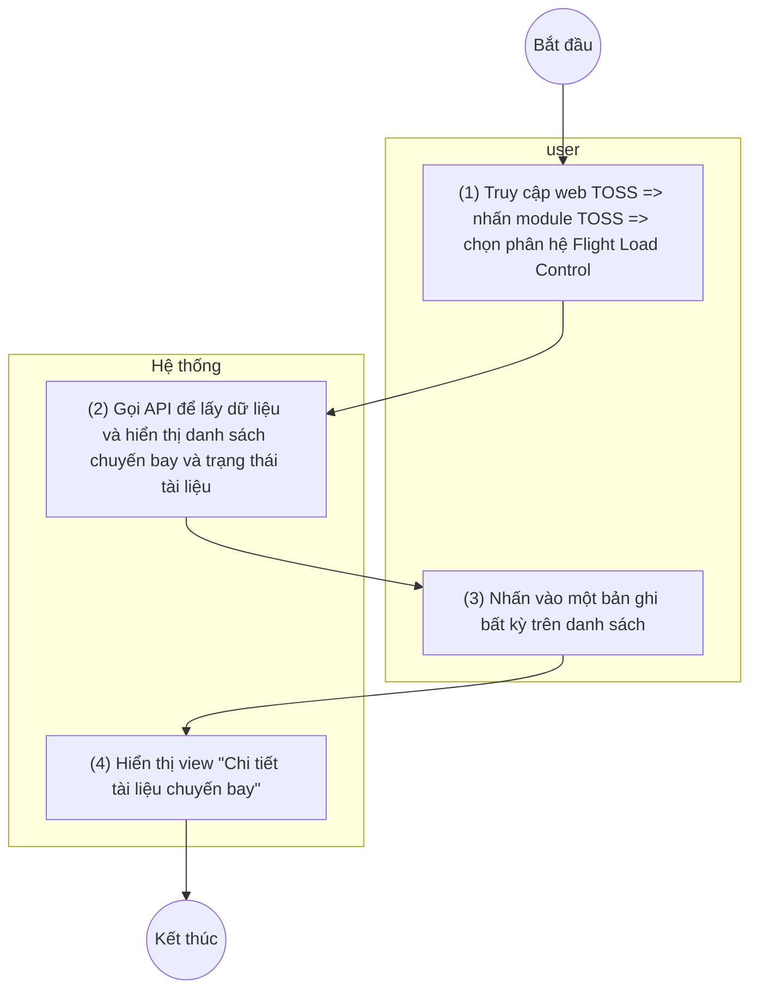

> **Phạm vi file:** Feature F02 (nhóm Document) — trích trung thực 100% từ nguồn SRS Flight Load Control do người soạn (CLAUDE.md §0), không suy diễn, không bổ sung. Cờ điểm cần xác nhận: xem CATALOG.md dòng #2. **Đồng bộ lại 2026-07-10 theo Google Doc version 2192:** mô tả STT 1 (số hiệu chuyến bay) đổi nguồn dữ liệu từ "Lấy từ cột Flight" thành "Dữ liệu đồng bộ từ Netline ops++".

## **Xem chi tiết tài liệu chuyến bay**

| **Tên chức năng: Xem chi tiết tài liệu chuyến bay** | |
| --- | --- |
| **Mục đích** | Cho phép user xem chi tiết tài liệu chuyến bay |
| **Trigger** | Người dùng truy cập vào web TOSS => nhấn module TOSS => Chọn phân hệ Flight load control => Chọn tab Document => Nhấn vào một bản ghi bất kỳ |
| **Tiền điều kiện** | Người dùng đăng nhập thành công và được phân quyền phân hệ Flight load control |
| **Hậu điều kiện** | Màn hình chi tiết tài liệu chuyến bay hiển thị |

### **Sơ đồ luồng hệ thống**

> Chuyển từ ảnh sơ đồ luồng gốc (UML Activity, 2 làn user/Hệ thống) trong Google Doc nguồn — ảnh gốc lưu tại [`_images/TOSS.FLC.FLIGHT_DOCS_DETAIL.sodo-luong.png`](../_images/TOSS.FLC.FLIGHT_DOCS_DETAIL.sodo-luong.png).

### **Mô tả luồng xử lý**

| Bước | Chi tiết |
| --- | --- |
| 1 | Người dùng truy cập hệ thống TOSS => Click module TOSS, chọn phân hệ Flight Load Control, sau đó chọn tab Document. |
| 2 | Hệ thống gọi API để lấy dữ liệu và hiển thị danh sách chuyến bay cùng trạng thái tài liệu lên màn hình |
| 3 | Người dùng nhấn chọn một bản ghi bất ký trên danh sách |
| 4 | Hệ thống hiển thị view “Chi tiết tài liệu chuyến bay”, tương ứng với bản ghi người dùng vừa thao tác |

### **Màn hình chức năng**

*(hình ảnh minh họa — xem file gốc/Google Doc)*

*(hình ảnh minh họa — xem file gốc/Google Doc)*

### **Mô tả chi tiết màn hình**

| **STT** | **Tên** | **Kiểu dữ liệu [Độ dài dữ liệu]** | **Mapping DB/API** | **Mô tả** |
| --- | --- | --- | --- | --- |
|  | *(hình ảnh minh họa — xem file gốc/Google Doc)* | | | |
| 1 | *(hình ảnh minh họa — xem file gốc/Google Doc)* | Label |  | * Top: Hiển thị số hiệu chuyến bay => Dữ liệu đồng bộ từ Netline ops++ * Bottom: Hiển thị ACREG + ACTYPE |
| *(hình ảnh minh họa — xem file gốc/Google Doc)* | Label |  | * Hiển thị ngày cất cánh dự kiến => Dữ liệu đồng bộ từ Netline ops++ |
| *(hình ảnh minh họa — xem file gốc/Google Doc)* | Label |  | * Top: Hiển thị giờ cất cánh dự kiến (ETD) =>Dữ liệu được đồng bộ từ Netline ops++ * Bottom: Hiển thị sân bay khởi hành theo định dạng IATA - ICAO => Dữ liệu được đồng bộ từ Netline ops++ |
| *(hình ảnh minh họa — xem file gốc/Google Doc)* | Label |  | * Top: Hiển thị giờ hạ cánh dự kiến => Dữ liệ được đồng bộ từ Netline * Bottom: Hiển thị sân bay khởi hành theo định dạng IATA - ICAO => Dữ liệu được đồng bộ từ Netline |
| 2 | *(hình ảnh minh họa — xem file gốc/Google Doc)* | icon |  | * Click icon x => Quay trở lại màn hình danh sách và tài liệu chuyến bay |
| 3 | Document Type | Tab |  | * Hiển thị các nhóm tài liệu: **Load Sheet**, **Gen. Declaration**, **Pax Manifest**. * Mặc định chọn **Load Sheet** * Khi user chọn tab khác, hệ thống hiển thị danh sách tài liệu của loại tương ứng. |
| 4 | Upload Area | View |  | * Vùng hiển thị chức năng tải lên tài liệu. * Tham chiếu kịch bản upload tài liệu |
| **Bảng dữ liệu thông tin tài liệu chuyến bay**   * ***Fix cứng 20 bản ghi phiên bản tài liệu và cho phép scroll*** | | | | |
| 5 | Document Name | Textview |  | * Hiển thị tên file tài liệu được upload/ đồng bộ về * Trường hợp API trả về rỗng/lỗi: để trống trường |
| 6 | Upload Date | Datetime |  | * Hiển thị thời gian tài liệu được upload/đồng bộ lên hệ thống.   *(hình ảnh minh họa — xem file gốc/Google Doc)*   * Định dạng ddMM hh:mm * Trường hợp API trả về rỗng/lỗi: để trống trường |
| 7 | ACK Time | Datetime |  | * Hiển thị thời điểm phi công confirm (ACK) tài liệu   *(hình ảnh minh họa — xem file gốc/Google Doc)*   * Định dạng ddMM hh:mm * Trường hợp API trả về rỗng/lỗi: để trống trường * *Đối với tài liệu đang ở trạng thái AWAIT ACK => Mặc định để trống trường này và hiển thị “---”* |
| 8 | Rev | Texview |  | * Hiển thị phiên bản (Revision) của tài liệu. Ví dụ: R01, R02. * Trường hợp API trả về rỗng/lỗi: để trống trường |
| 9 | Source | Texview |  | * Hiển thị nguồn của tài liệu: Có 2 nguồn:   + System: là nguồn đồng bộ từ hệ thống khác   + Manual: là nguồn user upload thủ công trên hệ thống TOSS |
| 10 | Status | Badge | status | * Hiển thị trạng thái hiện tại của tài liệu * Các trạng thái gồm:   + AWAIT ACK : tương ứng với trạng thái màu vàng trên màn hình danh sách   + REJECTED: tương ứng với trạng thái màu đỏ trên màn hình danh sách   + ACCEPTED: Tương ứng với trạng thái màu xanh trên màn hình danh sách |
|  | **User click vào 1 bản ghi => Poup xem chi tiết 1 tài liệu:**  *(hình ảnh minh họa — xem file gốc/Google Doc)* | | | |
| 11 | Tên file |  |  | * Hiển thị theo tên file gốc được đồng bộ/upload lên hệ thống tương ứng với cột Document Name |
| 12 | Trang hiện tại / Tổng số trang  *(hình ảnh minh họa — xem file gốc/Google Doc)* | page |  | * Hiển thị số trạng hiện tại người dùng đang xem / Tổng số trang của file. * Tại box số trang hiện tại cho phép người dùng nhập trực tiếp số trang muốn xem -> ấn enter để nhảy đến trang đó. * Chỉ cho phép nhập ký tự số từ 0->tổng số trang |
| 13 | *(hình ảnh minh họa — xem file gốc/Google Doc)* | Icon |  | * Cho phép click vào icon để thực hiện giảm kích thước hiển thị của tài liệu * Di chuột vào hiển thị tooltip: Zoom out * Bước nhảy: 10 * Min: 10% |
| 14 | *(hình ảnh minh họa — xem file gốc/Google Doc)* | Icon |  | * Cho phép click vào icon để thực hiện tăng kích thước hiển thị của tài liệu * Di chuột vào hiển thị tooltip: Zoom in * Bước nhảy: 10 * Max: 200% |
| 15 | *(hình ảnh minh họa — xem file gốc/Google Doc)* | Icon |  | * Cho phép user thực hiện click vào icon để xoay tài liệu 90 độ * Di chuột vào hiển thị tooltip: Rotate |
| 16 | *(hình ảnh minh họa — xem file gốc/Google Doc)* | Icon |  | * Lật tài liệu theo chiều ngang (trái ↔ phải). Mỗi lần nhấn sẽ chuyển đổi giữa trạng thái lật và trạng thái ban đầu. * Di chuột vào hiển thị tooltip: Flip Horizontal |
| 17 | *(hình ảnh minh họa — xem file gốc/Google Doc)* | Icon |  | * Lật tài liệu theo chiều dọc (trên ↔ dưới). Mỗi lần nhấn sẽ chuyển đổi giữa trạng thái lật và trạng thái ban đầu. * Di chuột vào hiển thị tooltip: Flip Vertical |
| 18 | *(hình ảnh minh họa — xem file gốc/Google Doc)* | Icon |  | * Click icon => Đóng popup view tài liệu và quay trở lại màn hình trước đó |
| 19 | *(hình ảnh minh họa — xem file gốc/Google Doc)* | Icon |  | * Cho phép user thực hiện click vào icon để download trực tiếp tài liệu về thiết bị * Di chuột vào hiển thị tooltip: Download |
| 20 | *(hình ảnh minh họa — xem file gốc/Google Doc)* | Icon |  | * Cho phép user thực hiện click vào icon để in trực tiếp tài liệu * Di chuột vào hiển thị tooltip: Printer |

---

**Nguồn trích:** `sec-05-xem-chi-tiet-tai-lieu-chuyen-bay.md` (mảnh phân rã h2 từ `VNA.TOSS_SRS_Flight Load Control_v0.1.md`, đã xóa sau khi tách theo Feature — git giữ lịch sử) · CATALOG.md dòng #2. **Đồng bộ lại 2026-07-10 theo Google Doc version 2192** (sửa 2026-07-10T10:57:39Z bởi chuyenly2003; bản phân rã trước theo version 2074).
