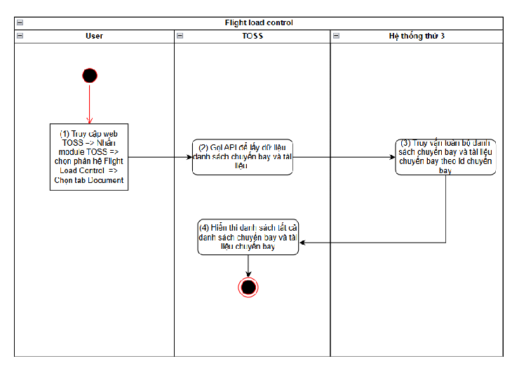
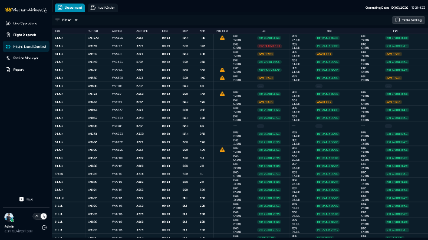

> **Phạm vi file:** Nội dung chức năng “Xem danh sách chuyến bay và trạng thái tài liệu đối với từng chuyến bay” được phân rã nguyên nghĩa từ Google Docs nguồn tại phạm vi chỉ mục 4790–10593. Không bổ sung hoặc suy diễn nghiệp vụ ngoài nguồn.

## **Xem danh sách chuyến bay và trạng thái tài liệu đối với từng chuyến bay**

| Tên chức năng: Xem danh sách chuyến bay và trạng thái tài liệu đối với từng chuyến bay |  |
| :---- | :---- |
| **Mục đích** | Cho phép user xem danh sách chuyến bay và trạng thái tài liệu đối với từng chuyến bay |
| **Trigger** | Người dùng truy cập vào web TOSS \=\> nhấn module TOSS \=\> Chọn phân hệ Flight load control \=\> Chọn tab Document |
| **Tiền điều kiện** | Người dùng đăng nhập thành công và được phân quyền phân hệ Flight load control |
| **Hậu điều kiện** | Mở màn hình danh sách chuyến bay \- trạng thái tài liệu đối với từng chuyến bay |
### **Sơ đồ luồng hệ thống**

### **Mô tả luồng xử lý**

| Bước | Chi tiết |
| :---: | :---- |
| 1 | Người dùng truy cập hệ thống TOSS \=\> Click module TOSS, chọn  phân hệ  Flight Load Control, sau đó chọn tab Document. |
| 2 | Hệ thống gọi API lấy đữ liệu danh sách toàn bộ chuyến bay và tài liệu |
| 3 | Đồng bộ danh sách chuyến bay từ Netline: Trường hợp data trả ra \# null \-\> có bản ghi danh sách chuyến bay, hiển thị bảng danh sách chuyến bay theo [quy tắc hiển thị](https://docs.google.com/document/d/1h5wsfTtU6sKJDIqZod2MKWhhjQTNB-BVEn5252n1ALs/edit#bookmark=kix.f4ogfe115qyu) Trường hợp data trả ra \= null \-\> không có bản ghi danh sách chuyến bay, hiển thị bảng danh sách chuyến bay trống kèm text “ No data”. Trường hợp lỗi đồng bộ từ Netline trong quá trình xử lý \=\> Hiển thị toast:  “*An error has occurred, please try again”* Đồng bộ tài liệu chuyến bay LS,GD,PM \=\> Hệ thống check ID chuyến bay nếu:  Tồn tại ID chuyến bay:  Hệ thống thực hiện lưu/cập nhật tài liệu vào đúng chuyến bay tương ứng.  Tài liệu mới được ghi nhận là phiên bản hiện hành và hiển thị trên màn hình tương ứng với các cột tài liệu Không tồn tại ID chuyến bay \=\>Hệ thống không thực hiện gắn tài liệu vào chuyến bay và không hiển thị trên màn hình do không xác định được chuyến bay tương ứng Timeout: Xảy ra lỗi trong quá trình xử lý \-\>  trả msg:  “*An error has occurred, please try again”*  |
| 4 | Hiển thị danh sách chuyến bay và tài liệu chuyến bay tương ứng |

####
### **Màn hình chức năng**

### **Mô tả chi tiết màn hình**

####

| STT | Tên | Kiểu dữ liệu\[Độ dài\] | Mapping DB/API | Mô tả nghiệp vụ |
| ----- | ----- | ----- | ----- | ----- |
|  | FE call API lấy danh sách chuyến bay và trạng thái tài liệu mới nhất hiển thị trên màn hình.  Các cột thông tin trên màn danh sách Các cột thông tin đồng bộ từ Netline ops \++  theo cơ chế \+-3 ngày, \+-30 ngày, 5p/lần EDD FLT NO  ACREG  ACTYPE  ETD  DEP  ARR  Cột cảnh báo PIC request: Hiển thị icon cảnh báo khi phi công request các đầu tài liệu trong chuyến bay bên MO plus Các cột tài liệu tương ứng với chuyến bay bao gồm  LS, GD, PM được đồng bộ về từ VMS/Amadeus **Quy tắc hiển thị:** Hiển thị danh sách chuyến bay trong khoảng ±18 giờ so với thời điểm hiện tại (UTC).  Danh sách được cập nhật theo thời gian thực. Thứ tự hiển thị theo chiều top → bottom: Chuyến bay chuẩn bị khai thác → Chuyến bay đang khai thác → Chuyến bay đã khai thác. Sắp xếp theo ETD giảm dần từ trên xuống **Các trạng thái tài liệu bao gồm:** Màu xanh: tài liệu đã được accept  Màu đỏ: tài liệu đã bị reject  Màu vàng: tài liệu đang chờ confirm Để trống: chuyến bay chưa có tài liệu Thông tin tài liệu hiển thị trên màn hình danh sách bao gồm : Khối thông tin đồng bộ/upload:   Rev tài liệu đồng bộ/upload (Ví dụ: Rev 01, 02,.....) Thời gian đồng bộ mới nhất: định dạng ddMMM( ví dụ; 23JUN, 24JUL,..) Khối thông tin trạng thái tài liệu:  Rev tài liệu mà phi công rejected/accepted/await ack (Ví dụ: Rev 01, 02,.....) Thời gian phi công rejected/accepted (với trạng thái AWAIT ACK thì không hiển thị thời gian): định dạng ddMMM( ví dụ; 23JUN, 24JUL,..)  Màu trạng thái tài liệu  |  |  |  |
|  | EDD | Datetime |  | EDD: Ngày dự kiến khởi hành   Hiển thị \[EDD \] theo dữ liệu API trả về Định dạng: ddMMM ( ví dụ: 23JUN) Trường hợp API trả về rỗng/lỗi: để trống trường |
|  | FLT NO  | Textview |  | FLIGHT: Số hiệu chuyến bay Hiển thị \[FLT NO \] theo dữ liệu API trả về Trường hợp API trả về rỗng/lỗi: để trống trường Dữ liệu trong cột hiển thị thông tin số hiệu của chuyến bay |
|  | ACREG | Textview |  | ACREG: Số hiệu đăng ký chuyến bay Hiển thị \[ACREG \] theo dữ liệu API trả về Trường hợp API trả về rỗng/lỗi: để trống trường Dữ liệu trong cột hiển thị thông tin số hiệu đăng ký của chuyến bay |
|  | ACTYPE | Textview |  | ACTYPE: Loại tàu bay  Hiển thị \[ACTYPE \] theo dữ liệu API trả về Trường hợp API trả về rỗng/lỗi: để trống trường Dữ liệu trong cột hiển thị thông tin loại tàu bay của chuyến bay |
|  | ETD | Textview |  | ETD: Thời gian cất cánh dự kiến Hiển thị \[ETD\] theo dữ liệu API trả về Trường hợp API trả về rỗng/lỗi: để trống trường  Dữ liệu trong cột hiển thị thông tin thời gian cất cánh dự kiến  Cấu trúc hiển thị: giờ \- phút (hh:mm) Trường này là cơ sở để hiển thị danh sách chuyến bay theo [quy tắc hiển thị](https://docs.google.com/document/d/1h5wsfTtU6sKJDIqZod2MKWhhjQTNB-BVEn5252n1ALs/edit#bookmark=id.gv48fwux7pm) |
|  | DEP | Textview |  |  DEP: Hiển thị thông tin Điểm đi Hiển thị \[DEP\] theo dữ liệu API trả về Trường hợp API trả về rỗng/lỗi: để trống trường Dữ liệu trong cột hiển thị thông tin Điểm đi của máy bay Hiển thị dưới dạng viết tắt của điểm đi |
|  | ARR | Textview |  | ARR: Hiển thị thông tin Điểm đến Hiển thị \[ARR \] theo dữ liệu API trả về Trường hợp API trả về rỗng/lỗi: để trống trường Dữ liệu trong cột hiển thị thông tin Điểm đến Hiển thị dưới dạng viết tắt của điểm đến |
|  | PIC REQUEST | Icon |  | Hiển thị icon   khi các đầu tài liệu bị phi công request từ MO plus Khi Hover details \=\> sẽ hiển thị tên tài liệu bi phi công request \+ thời gian request Tên tài liệu: LOADSHEET/GD/PM Thời gian request định dạng: ddMMM hh:mm Khi tài liệu bị request được đồng bộ/upload phiên bản mới về \=\> Hệ thống TOSS bắn noti vể MO thông báo cập nhật phiên bản mới nhất. Đồng thời ẩn tên tài liệu đó trong hover details. Nếu không còn tài liệu bị request thì thực hiện ẩn icon cảnh báo ở cột PIC REQUEST  |
|  | Các cột tài liệu:  LS, GD, PM  | Textview |  | Hiển thị thông tin tài liệu theo dữ liệu API trả về Trường hợp API trả về rỗng/lỗi: để trống trường Thông tin tài liệu của chuyến bay, tham chiếu:  [khối thông tin đồng bộ/upload](https://docs.google.com/document/d/1h5wsfTtU6sKJDIqZod2MKWhhjQTNB-BVEn5252n1ALs/edit#bookmark=kix.5imjiiftfg9y) [khối thông tin trạng thái tài liệu](https://docs.google.com/document/d/1h5wsfTtU6sKJDIqZod2MKWhhjQTNB-BVEn5252n1ALs/edit#bookmark=kix.hmvk3mz0995x)  |

##

---

**Nguồn trích:** [VNA.TOSS_SRS_Flight Load Control_v0.1](https://docs.google.com/document/d/1h5wsfTtU6sKJDIqZod2MKWhhjQTNB-BVEn5252n1ALs/edit) · Revision `ALtnJHw752QgcvhVUuNEE-hu5IMGBpSkN00WjYskJ9yEU_jTAh4oi9SCaz9AkZwFdMFX2SE4iKFybLDiZBdqCPcZtK6ptnEqmoPzVAMPTkU` · Google Docs index 4790–10593.
