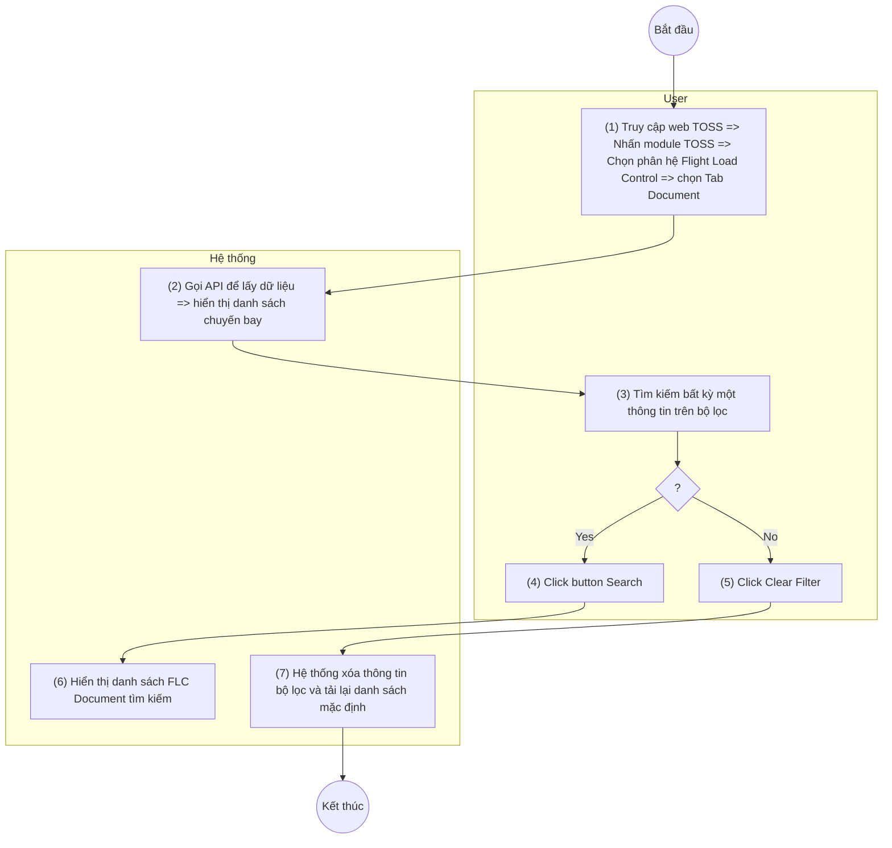

> **Phạm vi file:** Feature F04 (nhóm Document) — trích trung thực 100% từ nguồn SRS Flight Load Control do người soạn (CLAUDE.md §0), không suy diễn, không bổ sung. Cờ điểm cần xác nhận: xem CATALOG.md dòng #4. **Đồng bộ lại 2026-07-10 theo Google Doc version 2192:** trong khối quy tắc tìm kiếm, nguồn mới gạch bỏ (strikethrough) cụm "Set current page=1" và cụm "chân trang =" (giữ nguyên trạng gạch bỏ, không tự diễn giải) [Cần làm rõ: hiệu lực quy tắc reset trang/chân trang sau khi bị gạch bỏ — lưu ý mục Tìm kiếm bên tab Fuel Order KHÔNG bị gạch tương ứng].

## **Tìm kiếm chuyến bay**

| **Tên chức năng: Tìm kiếm chuyến bay** | |
| --- | --- |
| **Mục đích** | Cho phép user tìm kiếm danh sách chuyến bay |
| **Trigger** | Người dùng truy cập vào web TOSS => nhấn module TOSS => Chọn phân hệ Flight load control => Chọn tab Document |
| **Tiền điều kiện** | Người dùng đăng nhập thành công và được phân quyền phân hệ Flight load control |
| **Hậu điều kiện** | Hiển thị màn hình danh sách đã lọc theo tìm kiếm |

### ***Sơ đồ luồng***

> Chuyển từ ảnh sơ đồ luồng gốc (UML Activity, 2 làn User/Hệ thống) trong Google Doc nguồn — ảnh gốc lưu tại [`_images/TOSS.FLC.FLIGHT_SEARCH.sodo-luong.png`](../_images/TOSS.FLC.FLIGHT_SEARCH.sodo-luong.png).

### ***Mô tả luồng xử lý***

| Bước | Chi tiết |
| --- | --- |
| 1 | Người dùng truy cập hệ thống TOSS => Click module TOSS, chọn phân hệ Flight Load Control, sau đó chọn tab Document. |
| 2 | Hệ thống gọi API và hiển thị danh sách chuyến bay cùng trạng thái tài liệu lên màn hình |
| 3 | Người dùng nhập một hoặc nhiều điều kiện tìm kiếm trên bộ lọc. |
| 4 | **Trường hợp Tìm kiếm (Search):**  - User click button **Search**.  - Hệ thống xử lý, gọi API theo điều kiện lọc và hiển thị danh sách FLC Document tương ứng với kết quả tìm kiếm. |
| 5 | **Trường hợp Xóa bộ lọc (Clear Filter):**  - User click button **Clear Filter**.  - Hệ thống xóa toàn bộ thông tin/điều kiện đã nhập trên bộ lọc (Đồng thời tự động lấy lại danh sách mặc định như bước  2). |

### ***Màn hình chức năng***

*(hình ảnh minh họa — xem file gốc/Google Doc)*

### ***Mô tả chi tiết màn hình***

| **STT** | **Tên** | **Kiểu dữ liệu [Độ dài]** | **Mapping DB/API** | **Mô tả nghiệp vụ** |
| --- | --- | --- | --- | --- |
| * Tìm kiếm:   *(hình ảnh minh họa — xem file gốc/Google Doc)*   * Cơ chế Thu gọn/Mở rộng bộ lọc (Collapsible Filter): *(hình ảnh minh họa — xem file gốc/Google Doc)*[Tham chiếu kịch bản chức năng ẩn hiện filter](https://docs.google.com/document/d/1L5y0t4FCWe_vnNI65xNMRC-LM3lvLwYsQRAm_Nokv9A/edit?tab=t.0#heading=h.dgq51psil6dr) * Trường hợp Searchbox không có dữ liệu: Mặc định tìm kiếm all dữ liệu tại cột đó * Người dùng thao tác thay đổi giá trị trường dữ liệu => click Enter/button ***(hình ảnh minh họa — xem file gốc/Google Doc)*** => hệ thống thực hiện:   + Reload dữ liệu table phù hợp với bộ lọc   + ~~Set current page=1~~ * Hiển thị kết quả tìm kiếm:   + Trường hợp API trả về data có KQ: hiển thị danh sách dữ liệu theo kết quả API trả về.   + Trường hợp API trả về data rỗng hoặc lỗi: Hiển thị bảng danh sách với **~~chân trang =~~ Tất cả danh sách : 0**. | | | | |
| 1 | FLT NO | Textbox |  | * Mặc định: Để trống * Placeholder: FLT NO * Trường để lọc: Tìm kiếm gần đúng theo [FLT NO] * Maxlength 10 ký tự * Validate cho phép nhập chữ, số, và ký tự đặc biệt * Nếu dữ liệu nhập vượt quá độ dài ô => thay thế phần vượt quá bằng ký tự “...” và có tooltip hiển thị toàn bộ nội dung nhập * Nếu paste đoạn văn thì ghi nhận 10 ký tự đầu * Không cho phép nhận space * Tự động TRIM Spaces đầu cuối khi tìm kiếm |
| 2 | ACREG | Textbox |  | * Mặc định: Để trống * Placeholder: ACREG * Trường để lọc: Tìm kiếm gần đúng theo [ACREG] * Maxlength 10 ký tự * Validate cho phép nhập chữ, số, và ký tự đặc biệt * Nếu dữ liệu nhập vượt quá độ dài ô => thay thế phần vượt quá bằng ký tự “...” và có tooltip hiển thị toàn bộ nội dung nhập * Nếu paste đoạn văn thì ghi nhận 10 ký tự đầu * Không cho phép nhận space * Tự động TRIM Spaces đầu cuối khi tìm kiếm |
| 3 | ACTYPE | Textbox |  | * Mặc định: Để trống * Placeholder: ACTYPE * Trường để lọc: Tìm kiếm gần đúng theo [ACTYPE] * Maxlength 10 ký tự * Validate cho phép nhập chữ, số, và ký tự đặc biệt * Nếu dữ liệu nhập vượt quá độ dài ô => thay thế phần vượt quá bằng ký tự “...” và có tooltip hiển thị toàn bộ nội dung nhập * Nếu paste đoạn văn thì ghi nhận 10 ký tự đầu * Không cho phép nhận space * Tự động TRIM Spaces đầu cuối khi tìm kiếm |
|  | ETD | Time picker |  | * Mặc định: Để trống * Place holder: ETD * Trường để lọc: Tìm kiếm các chuyến bay trùng khớp theo [ETD] * Cho phép chọn thời gian cất cánh dự kiến (Estimated Time of Departure) theo múi giờ UTC. * Định dạng HH:mm. |
| 4 | DEP | Textbox |  | * Mặc định: Để trống * Placeholder: DEP * Trường để lọc: Tìm kiếm gần đúng theo [DEP] * Maxlength 10 ký tự * Validate cho phép nhập chữ, số, và ký tự đặc biệt * Nếu dữ liệu nhập vượt quá độ dài ô => thay thế phần vượt quá bằng ký tự “...” và có tooltip hiển thị toàn bộ nội dung nhập * Nếu paste đoạn văn thì ghi nhận 10 ký tự đầu * Không cho phép nhận space * Tự động TRIM Spaces đầu cuối khi tìm kiếm |
| 5 | ARR | Textbox |  | * Mặc định: Để trống * Placeholder: ARR * Trường để lọc: Tìm kiếm gần đúng theo [ARR] * Maxlength 10 ký tự * Validate cho phép nhập chữ, số, và ký tự đặc biệt * Nếu dữ liệu nhập vượt quá độ dài ô => thay thế phần vượt quá bằng ký tự “...” và có tooltip hiển thị toàn bộ nội dung nhập * Nếu paste đoạn văn thì ghi nhận 10 ký tự đầu * Không cho phép nhận space * Tự động TRIM Spaces đầu cuối khi tìm kiếm |
| 6 | *(hình ảnh minh họa — xem file gốc/Google Doc)* | Button |  | * Click vào *(hình ảnh minh họa — xem file gốc/Google Doc)* * Hệ thống thực hiện lọc dữ liệu dựa trên từ khoá * Hệ thống trả về danh sách dữ liệ u phù hợp với từ khoá tìm kiếm |
| 7 | *(hình ảnh minh họa — xem file gốc/Google Doc)* | Button |  | * Click vào *(hình ảnh minh họa — xem file gốc/Google Doc)* * Hệ thống:   + Xoá nội dung search   + Reset toàn trường lọc đã chọn   + Reset phân trang về trang đầu * Hiển thị lại danh sách ban đầu |

---

**Nguồn trích:** `sec-07-tim-kiem-chuyen-bay.md` (mảnh phân rã h2 từ `VNA.TOSS_SRS_Flight Load Control_v0.1.md`, đã xóa sau khi tách theo Feature — git giữ lịch sử) · CATALOG.md dòng #4. **Đồng bộ lại 2026-07-10 theo Google Doc version 2192** (sửa 2026-07-10T10:57:39Z bởi chuyenly2003; bản phân rã trước theo version 2074).
