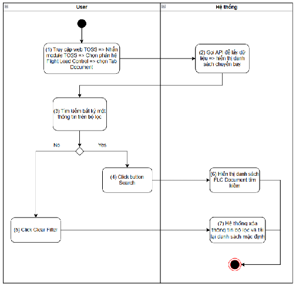

> **Phạm vi file:** Nội dung chức năng “Tìm kiếm chuyến bay” được phân rã nguyên nghĩa từ Google Docs nguồn tại phạm vi chỉ mục 19543–23940. Không bổ sung hoặc suy diễn nghiệp vụ ngoài nguồn.

## **Tìm kiếm chuyến bay**

| Tên chức năng: Tìm kiếm chuyến bay  |  |
| :---- | :---- |
| **Mục đích** | Cho phép user tìm kiếm danh sách chuyến bay |
| **Trigger** | Người dùng truy cập vào web TOSS \=\> nhấn module TOSS \=\> Chọn phân hệ Flight load control \=\> Chọn tab Document |
| **Tiền điều kiện** | Người dùng đăng nhập thành công và được phân quyền phân hệ Flight load control |
| **Hậu điều kiện** | Hiển thị màn hình danh sách đã lọc theo tìm kiếm |
### **Sơ đồ luồng hệ thống**

### **Mô tả luồng xử lý**

| Bước | Chi tiết |
| :---: | :---- |
| 1 | Người dùng truy cập hệ thống TOSS \=\> Click module TOSS, chọn  phân hệ  Flight Load Control, sau đó chọn tab Document. |
| 2 | Hệ thống gọi API và hiển thị danh sách chuyến bay cùng trạng thái tài liệu lên màn hình |
| 3 | Người dùng nhập một hoặc nhiều điều kiện tìm kiếm trên bộ lọc. |
| 4 | **Trường hợp Tìm kiếm (Search):** \- User click button **Search**. \- Hệ thống xử lý, gọi API theo điều kiện lọc và hiển thị danh sách chuyến bay và trạng thái tài liệu tương ứng với kết quả tìm kiếm.  |
| 5 | **Trường hợp Xóa bộ lọc (Clear Filter):** \- User click button **Clear Filter**. \- Hệ thống xóa toàn bộ thông tin/điều kiện đã nhập trên bộ lọc (Đồng thời tự động lấy lại danh sách mặc định như bước  2).  |

###
### **Màn hình chức năng**

### **Mô tả chi tiết màn hình**

| STT | Tên | Kiểu dữ liệu\[Độ dài\] | Mapping DB/API | Mô tả nghiệp vụ |
| ----- | ----- | ----- | ----- | ----- |
| Tìm kiếm:  Cơ chế Thu gọn/Mở rộng bộ lọc (Collapsible Filter): [Tham chiếu kịch bản chức năng ẩn hiện filter](https://docs.google.com/document/d/1L5y0t4FCWe_vnNI65xNMRC-LM3lvLwYsQRAm_Nokv9A/edit?tab=t.0#heading=h.bzejlqwncqtz) Trường hợp Searchbox không có dữ liệu: Mặc định tìm kiếm all dữ liệu tại cột đó  Người dùng thao tác thay đổi giá trị trường dữ liệu \=\> click Enter/button **** \=\> hệ thống thực hiện: Reload dữ liệu table phù hợp với bộ lọc Hiển thị kết quả tìm kiếm:  Trường hợp API trả về data có KQ: hiển thị danh sách dữ liệu theo kết quả API trả về. Trường hợp API trả về data rỗng hoặc lỗi: Hiển thị bảng danh sách với **Tất cả danh sách : 0**.   |  |  |  |  |
| 1 | FLT NO | Textbox |  | Mặc định: Để trống Placeholder: FLT NO Trường để lọc: Tìm kiếm gần đúng theo \[FLT NO\]  Maxlength 10 ký tự  Validate cho phép nhập chữ, số, và ký tự đặc biệt  Nếu dữ liệu nhập vượt quá độ dài ô \=\> thay thế phần vượt quá bằng ký tự “...” và có tooltip hiển thị toàn bộ nội dung nhập  Nếu paste đoạn văn thì ghi nhận 10 ký tự đầu  Không cho phép nhận space  Tự động TRIM Spaces đầu cuối khi tìm kiếm |
| 2 | ACREG | Textbox |  | Mặc định: Để trống Placeholder: ACREG Trường để lọc: Tìm kiếm gần đúng theo \[ACREG\]  Maxlength 10 ký tự  Validate cho phép nhập chữ, số, và ký tự đặc biệt  Nếu dữ liệu nhập vượt quá độ dài ô \=\> thay thế phần vượt quá bằng ký tự “...” và có tooltip hiển thị toàn bộ nội dung nhập  Nếu paste đoạn văn thì ghi nhận 10 ký tự đầu  Không cho phép nhận space  Tự động TRIM Spaces đầu cuối khi tìm kiếm |
| 3 | ACTYPE | Textbox |  | Mặc định: Để trống Placeholder: ACTYPE Trường để lọc: Tìm kiếm gần đúng theo \[ACTYPE\]  Maxlength 10 ký tự  Validate cho phép nhập chữ, số, và ký tự đặc biệt  Nếu dữ liệu nhập vượt quá độ dài ô \=\> thay thế phần vượt quá bằng ký tự “...” và có tooltip hiển thị toàn bộ nội dung nhập  Nếu paste đoạn văn thì ghi nhận 10 ký tự đầu  Không cho phép nhận space  Tự động TRIM Spaces đầu cuối khi tìm kiếm |
| 4 | ETD | Time picker |  | Mặc định: Để trống Place holder: ETD Trường để lọc: Tìm kiếm các chuyến bay trùng khớp theo \[ETD\]  Cho phép chọn thời gian cất cánh dự kiến (Estimated Time of Departure) theo múi giờ UTC.  Định dạng  HH:mm.  |
| 5 | DEP | Textbox |  | Mặc định: Để trống Placeholder: DEP Trường để lọc: Tìm kiếm gần đúng theo \[DEP\]  Maxlength 10 ký tự  Validate cho phép nhập chữ, số, và ký tự đặc biệt  Nếu dữ liệu nhập vượt quá độ dài ô \=\> thay thế phần vượt quá bằng ký tự “...” và có tooltip hiển thị toàn bộ nội dung nhập  Nếu paste đoạn văn thì ghi nhận 10 ký tự đầu  Không cho phép nhận space  Tự động TRIM Spaces đầu cuối khi tìm kiếm |
| 6 | ARR | Textbox  |  | Mặc định: Để trống Placeholder: ARR Trường để lọc: Tìm kiếm gần đúng theo \[ARR\]  Maxlength 10 ký tự  Validate cho phép nhập chữ, số, và ký tự đặc biệt  Nếu dữ liệu nhập vượt quá độ dài ô \=\> thay thế phần vượt quá bằng ký tự “...” và có tooltip hiển thị toàn bộ nội dung nhập  Nếu paste đoạn văn thì ghi nhận 10 ký tự đầu  Không cho phép nhận space  Tự động TRIM Spaces đầu cuối khi tìm kiếm |
| 7 |  | Button |  |   Click vào  Hệ thống thực hiện lọc dữ liệu dựa trên từ khoá Hệ thống trả về danh sách dữ liệ u phù hợp với từ khoá tìm kiếm |
| 8 |  | Button |  | Click vào  Hệ thống: Xoá nội dung search Reset toàn trường lọc đã chọn Hiển thị lại danh sách ban đầu  |

   ##

---

**Nguồn trích:** [VNA.TOSS_SRS_Flight Load Control_v0.1](https://docs.google.com/document/d/1h5wsfTtU6sKJDIqZod2MKWhhjQTNB-BVEn5252n1ALs/edit) · Revision `ALtnJHxtgop8tqU1H4gOvgIdTgE39wuW0tXeTq11SiDids1CLuKzRUNhr3GxQkpotgiqrqrdOBQNUeCsjS--F24FhdUDJiRoJFzN8MNoC2k` · Google Docs index 19543–23940.
