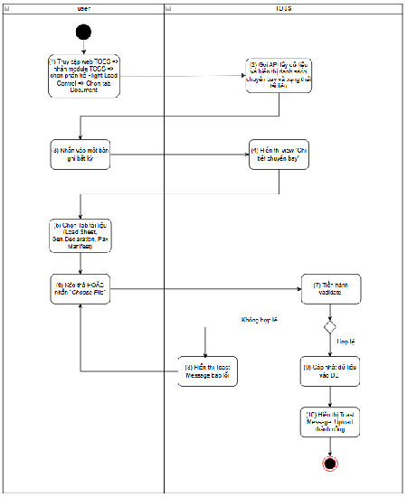
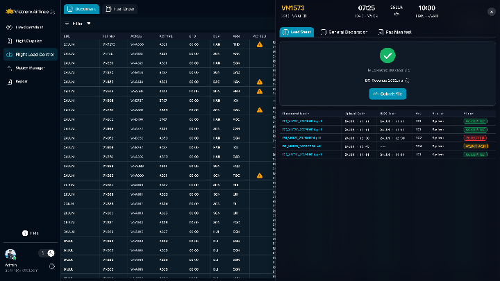
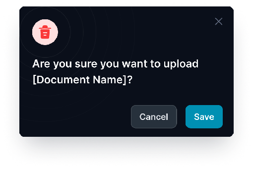
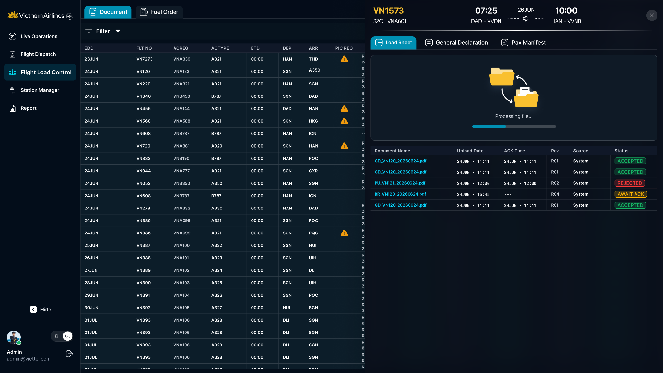

> **Phạm vi file:** Nội dung chức năng “Upload tài liệu chuyến bay” được phân rã nguyên nghĩa từ Google Docs nguồn tại phạm vi chỉ mục 15547–19551. Không bổ sung hoặc suy diễn nghiệp vụ ngoài nguồn.

## **Upload tài liệu chuyến bay**

| Tên chức năng: Upload tài liệu chuyến bay |  |
| :---- | :---- |
| **Mục đích** | Cho phép user upload tài liệu chuyến bay  |
| **Trigger** | Người dùng truy cập vào web TOSS \=\> nhấn module TOSS \=\> Chọn phân hệ Flight load control \=\> Chọn tab Document \=\> Nhấn vào một bản ghi bất kỳ \=\> Hiển thị details chuyến bay \=\> Nhấn tab tài liệu  |
| **Tiền điều kiện** | Người dùng đăng nhập thành công và được phân quyền chức năng upload tại phân hệ Flight load control |
| **Hậu điều kiện** | Upload tài liệu chuyến bay thành công   |
### **Sơ đồ luồng hệ thống**

### **Mô tả luồng xử lý**

| Bước | Chi tiết |
| :---: | :---- |
| 1,2 | Người dùng truy cập hệ thống TOSS \=\> Click module TOSS, chọn  phân hệ  Flight Load Control, sau đó chọn tab Document. Hệ thống gọi API và hiển thị danh sách chuyến bay cùng trạng thái tài liệu lên màn hình |
| 3 | Người dùng nhấn vào một bản ghi chuyến bay bất kỳ trên danh sách  |
| 4 | Hiển thị màn hình *“Chi tiết chuyến bay”* |
| 5 | Tại màn hình chi tiết người dùng chọn loại tài liệu cần Upload thông qua các Tab: Load Sheet, Gen.Declaration hoặc Pax Manifest. |
| 6 | Người dùng thực hiện **kéo thả file (Drag & drop)** vào vùng chỉ định, HOẶC nhấn button   để duyệt và chọn file từ thiết bị  |
| 7 | Hệ thống tiến hành vadidate nếu Nếu file không hợp lệ chuyển sang Bước 8  Nếu file hợp lệ chuyển sang bước 9 |
| 8 | Hệ thống hiển thị Toast Message báo lỗi: *“Failed to upload document. Please try again”*. Tiến trình tài file bị hủy, người dùng có thể chọn lại file khác |
| 9 | Hệ thống cập nhật dữ liệu vào DB |
| 10 | FE hiển thị Toast Message thành công : “*Document uploaded successfully*” |

   ###
### **Màn hình chức năng**

      

       

      
### **Mô tả chi tiết màn hình**

| STT | Tên | Kiểu dữ liệu \[Độ dài dữ liệu\] | Mapping DB/API | Mô tả |
| :---- | :---- | :---- | :---- | :---- |
| 1 | Title  | Textview |  | Text cứng “Drag \[tên tài liệu LS/GD/PM\] file here” |
| 2 | Chú thích | Textview |  |  Hiển thị chú thích các định dạng tài liệu được hỗ trợ: “Accepted formats are .pdf,.txt (maximum 30MB)  “  |
| 3 |  | Button |  | *Quy tắc đặt tên: LOADSHEET/GD/PM\_\[FLT NO\]\_\[R\<Phiên bản tài liệu\>\]\_\[EDD\].\[định dạng tên file\] Ví dụ: LOADSHEET\_VN343\_R01\_02JUL26.TXT* Button “Select file” cho phép chọn tài liệu hoặc kéo thả file vào khu vực button để upload Chặn tất cả các thao tác trên màn khi user đang thực hiện upload file Các TH lỗi \=\> Thực hiện disable button  và check các lỗi theo thứ tự sau:  TH  file không đúng định dạng hiển thị IM: *“Invalid file format. Only .pdf, .txt  files are supported”* TH file mà vượt quá dung lượng=\> Thông báo lỗi nếu tệp vượt quá giới hạn kích thước *“The file is too large. Please upload a file smaller than 30MB.”* TH file không đúng quy tắc đặt tên hoặc không đúng tên tài liệu được phép upload ở tab đó=\> Hiển thị toast: “*Invalid document name*” TH mã chuyến bay và ngày cất cánh dự kiến ở tên file không khớp với chuyến bay upload \=\> Hiển thị toast: *“The flight information in the file name does not match the selected flight.”* TH upload tài liệu có Revision nhỏ hơn hoặc bằng Revision hiện tại của cùng loại tài liệu trong cùng chuyến bay  \=\> Hiển thị toast*: “The document revision must be higher than the current revision. Please upload a newer revision ”* TH lỗi hệ thống, timeout hoặc mất kết nối mạng trong quá trình upload ⇒ Hiển thị IM: *"Failed to upload document. Please try again."*  TH tên file vượt quá độ rộng box \=\> hiển thị dấu …..tooltips hiển thị full tên file  :  Click icon xóa tại tên tài liệu \=\> xóa file hiện tại và hiển thị lại button  User nhấn \=\> Hiển thị popup xác nhận upload:    Fix cứng icon và không cho thao tác  Click icon x \=\> quay trở lại màn trước đó Content  “Are you sure you want to upload \[Document Name\]? “  Click button \=\> Quay trở lại màn trước đó  Click button \=\> Hiển thị giao diện Processing:   Khi tài liệu được upload \=\> Hệ thống cập nhật trạng thái tài liệu \+ thời gian upload \+ Rev tài liệu lên màn hình. Hiển thị tài liệu lên đầu bảng thông tin tài liệu. Chuyển trạng thái tài liệu về AWAIT ACK (màu vàng) Hiển thị toast thông báo upload thành công “*Document uploaded successfully*” Đồng thời bắn noti về MO cập nhật tài liệu   |

   ##

---

**Nguồn trích:** [VNA.TOSS_SRS_Flight Load Control_v0.1](https://docs.google.com/document/d/1h5wsfTtU6sKJDIqZod2MKWhhjQTNB-BVEn5252n1ALs/edit) · Revision `ALtnJHw752QgcvhVUuNEE-hu5IMGBpSkN00WjYskJ9yEU_jTAh4oi9SCaz9AkZwFdMFX2SE4iKFybLDiZBdqCPcZtK6ptnEqmoPzVAMPTkU` · Google Docs index 15547–19551.
