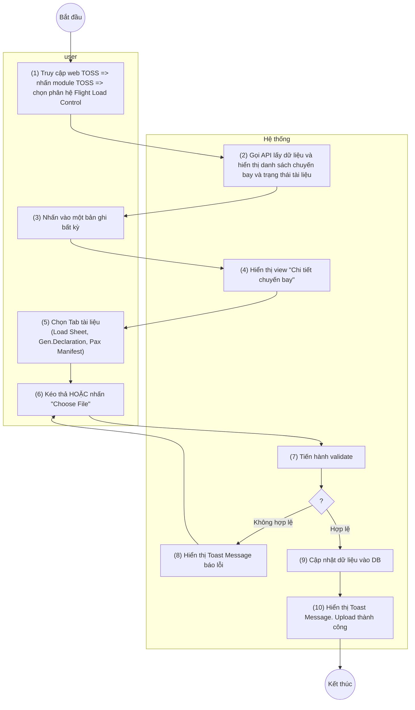

> **Phạm vi file:** Feature F03 (nhóm Document) — trích trung thực 100% từ nguồn SRS Flight Load Control do người soạn (CLAUDE.md §0), không suy diễn, không bổ sung. Cờ điểm cần xác nhận: xem CATALOG.md dòng #3.
>
> **Đồng bộ lại 2026-07-10 theo Google Doc version 2192 — mục STT 3 được viết lại đáng kể trong nguồn:** khối "Quy tắc đặt tên file tài liệu" chuyển khỏi mục này (nay nằm ở khối quy tắc của "Xem danh sách chuyến bay..." — file FLIGHT_LIST); bộ validate lỗi đổi thành chuỗi kiểm tra theo thứ tự (định dạng chỉ .pdf → dung lượng 30MB → tên tài liệu → khớp chuyến bay/ngày cất cánh → Revision phải cao hơn hiện tại → lỗi hệ thống/timeout); bỏ trường hợp "File already uploaded for another flight". [Cần làm rõ: mâu thuẫn nội tại trong nguồn — trường 2 vẫn ghi chú thích "Accepted formats are .pdf,.txt (maximum 5MB)" và ví dụ tên file đuôi .TXT, trong khi validate mới chỉ chấp nhận .pdf và giới hạn 30MB]

## **Upload tài liệu chuyến bay**

| **Tên chức năng: Upload tài liệu chuyến bay** | |
| --- | --- |
| **Mục đích** | Cho phép user upload tài liệu chuyến bay |
| **Trigger** | Người dùng truy cập vào web TOSS => nhấn module TOSS => Chọn phân hệ Flight load control => Chọn tab Document => Nhấn vào một bản ghi bất kỳ => Hiển thị details chuyến bay => Nhấn tab tài liệu |
| **Tiền điều kiện** | Người dùng đăng nhập thành công và được phân quyền chức năng upload tại phân hệ Flight load control |
| **Hậu điều kiện** | Upload tài liệu chuyến bay thành công |

### **Sơ đồ luồng hệ thống**

> Chuyển từ ảnh sơ đồ luồng gốc (UML Activity, 2 làn user/Hệ thống) trong Google Doc nguồn — ảnh gốc lưu tại [`_images/TOSS.FLC.UPLOAD_FLIGHT_DOC.sodo-luong.png`](../_images/TOSS.FLC.UPLOAD_FLIGHT_DOC.sodo-luong.png).

### **Mô tả luồng xử lý**

| Bước | Chi tiết |
| --- | --- |
| 1,2 | Người dùng truy cập hệ thống TOSS => Click module TOSS, chọn phân hệ Flight Load Control, sau đó chọn tab Document.  Hệ thống gọi API và hiển thị danh sách chuyến bay cùng trạng thái tài liệu lên màn hình |
| 3 | Người dùng nhấn vào một bản ghi chuyến bay bất kỳ trên danh sách |
| 4 | Hiển thị màn hình *“Chi tiết chuyến bay”* |
| 5 | Tại màn hình chi tiết người dùng chọn loại tài liệu cần Upload thông qua các Tab: Load Sheet, Gen.Declaration hoặc Pax Manifest. |
| 6 | Người dùng thực hiện **kéo thả file (Drag & drop)** vào vùng chỉ định, HOẶC nhấn button *(hình ảnh minh họa — xem file gốc/Google Doc)* để duyệt và chọn file từ thiết bị |
| 7 | Hệ thống tiến hành vadidate nếu   * Nếu file không hợp lệ chuyển sang Bước 8 * Nếu file hợp lệ chuyển sang bước 9 |
| 8 | Hệ thống hiển thị Toast Message báo lỗi: *“Failed to upload document. Please try again”*. Tiến trình tài file bị hủy, người dùng có thể chọn lại file khác |
| 9 | Hệ thống cập nhật dữ liệu vào DB |
| 10 | FE hiển thị Toast Message thành công : “*Document uploaded successfully*” |

### **Màn hình chức năng**

*(hình ảnh minh họa — xem file gốc/Google Doc)*

*(hình ảnh minh họa — xem file gốc/Google Doc)*

### **Mô tả chi tiết màn hình**

| **STT** | **Tên** | **Kiểu dữ liệu [Độ dài dữ liệu]** | **Mapping DB/API** | **Mô tả** |
| --- | --- | --- | --- | --- |
| 1 | Title | Textview |  | * Text cứng “Drag [tên tài liệu LS/GD/PM] file here” |
| 2 | Chú thích | Textview |  | * Hiển thị chú thích các định dạng tài liệu được hỗ trợ: “Accepted formats are .pdf,.txt (maximum 5MB) “ |
| 3 | *(hình ảnh minh họa — xem file gốc/Google Doc)* | Button |  | *Ví dụ: LOADSHEET_VN343_R01_02JUL26.TXT*   * Button “Select file” cho phép chọn tài liệu hoặc kéo thả file vào khu vực button để upload * Chặn tất cả các thao tác trên màn khi user đang thực hiện upload file * Các TH lỗi => Thực hiện disable button *(hình ảnh minh họa — xem file gốc/Google Doc)* và check các lỗi theo thứ tự sau:   + TH file không đúng định dạng hiển thị IM: *“Invalid file format. Only .pdf files are supported”*   + TH file mà vượt quá dung lượng=> Thông báo lỗi nếu tệp vượt quá giới hạn kích thước *“The file is too large. Please upload a file smaller than 30MB.”*   + TH file không đúng quy tắc đặt tên hoặc không đúng tên tài liệu được phép upload ở tab đó=> Hiển thị IM: “*Invalid document name*”   + TH mã chuyến bay và ngày cất cánh dự kiến ở tên file không khớp với chuyến bay upload => Hiển thị IM: *“The flight information in the file name does not match the selected flight.”*   + TH upload tài liệu có Revision nhỏ hơn hoặc bằng Revision hiện tại của cùng loại tài liệu trong cùng chuyến bay => Hiển thị IM*: “The document revision must be higher than the current revision. Please upload a newer revision ”*   + TH lỗi hệ thống, timeout hoặc mất kết nối mạng trong quá trình upload ⇒ Hiển thị IM: *"Failed to upload document. Please try again."*   + TH tên file vượt quá độ rộng box => hiển thị dấu …..tooltips hiển thị full tên file * *(hình ảnh minh họa — xem file gốc/Google Doc)* : Click icon xóa tại tên tài liệu => xóa file hiện tại và hiển thị lại button *(hình ảnh minh họa — xem file gốc/Google Doc)* * User nhấn *(hình ảnh minh họa — xem file gốc/Google Doc)*=> Hiển thị popup xác nhận upload:   *(hình ảnh minh họa — xem file gốc/Google Doc)*   | *(hình ảnh minh họa — xem file gốc/Google Doc)* | * Fix cứng icon và không cho thao tác | | --- | --- | | *(hình ảnh minh họa — xem file gốc/Google Doc)* | * Click icon x => quay trở lại màn trước đó | | Content | “Are you sure you want to upload [Document Name]? “ | | *(hình ảnh minh họa — xem file gốc/Google Doc)* | * Click button => Quay trở lại màn trước đó | | *(hình ảnh minh họa — xem file gốc/Google Doc)* | * Click button => Hiển thị giao diện Processing: * *(hình ảnh minh họa — xem file gốc/Google Doc)* * Khi tài liệu được upload => Hệ thống cập nhật trạng thái tài liệu + thời gian upload + Rev tài liệu lên màn hình. Hiển thị tài liệu lên đầu bảng thông tin tài liệu.   + Chuyển trạng thái tài liệu về AWAIT ACK (màu vàng)   + Hiển thị toast thông báo upload thành công “*Document uploaded successfully*”   + Đồng thời bắn noti về MO cập nhật tài liệu | |

---

**Nguồn trích:** `sec-06-upload-tai-lieu-chuyen-bay.md` (mảnh phân rã h2 từ `VNA.TOSS_SRS_Flight Load Control_v0.1.md`, đã xóa sau khi tách theo Feature — git giữ lịch sử) · CATALOG.md dòng #3. **Đồng bộ lại 2026-07-10 theo Google Doc version 2192** (sửa 2026-07-10T10:57:39Z bởi chuyenly2003; bản phân rã trước theo version 2074).
