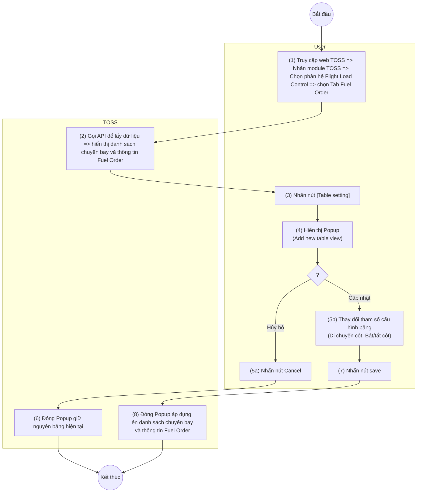

> **Phạm vi file:** Feature F10 (nhóm Fuel order) — trích trung thực 100% từ nguồn SRS Flight Load Control do người soạn (CLAUDE.md §0), không suy diễn, không bổ sung. Cờ điểm cần xác nhận: xem CATALOG.md dòng #10 và mục 2.1 — Title/Trigger/Bước 1–2/mô tả trường 1–6 đã nhất quán nói về "Fuel Order"/"Flight Monitoring table setting", NHƯNG **dòng mô tả trường 7 (nút Save) vẫn còn sót cụm "Đóng Popup 'Document table setting'"** [Cần làm rõ: dấu vết sao chép chéo chưa dọn hết — giữ nguyên trạng, không tự sửa].

## **Customize bảng biểu**

| **Tên chức năng: Table Setting** | |
| --- | --- |
| **Mục đích** | Cho phép user Customize bảng biểu |
| **Trigger** | Người dùng truy cập vào web TOSS => nhấn module TOSS => Chọn phân hệ Flight load control => Chọn tab Fuel Order => Chọn *(hình ảnh minh họa — xem file gốc/Google Doc)* |
| **Tiền điều kiện** | Người dùng đăng nhập thành công và được phân quyền phân hệ Flight load control |
| **Hậu điều kiện** | Hiển thị màn hình danh sách chuyến bay và thông tin Fuel Order khi user Customize |

### **Sơ đồ luồng hệ thống**

> Chuyển từ ảnh sơ đồ luồng gốc (UML Activity, 2 làn User/TOSS) trong Google Doc nguồn — ảnh gốc lưu tại [`_images/TOSS.FLC.CUSTOMIZE_FUEL_TABLE.sodo-luong.png`](../_images/TOSS.FLC.CUSTOMIZE_FUEL_TABLE.sodo-luong.png).

### **Mô tả luồng xử lý**

| Bước | Chi tiết |
| --- | --- |
| 1 | Người dùng truy cập hệ thống TOSS => Click module TOSS, chọn phân hệ Flight Load Control, sau đó chọn tab Fuel Order |
| 2 | Hệ thống gọi API và hiển thị danh sách chuyến bay và thông tin Fuel Order lên màn hình |
| 3 | Người dùng click button *(hình ảnh minh họa — xem file gốc/Google Doc)* |
| 4 | Hệ thống hiển thị Popup **Flight Monitoring table setting** (Hiển thị list toàn bộ các cột dữ liệu hiện có) |
| 5 | Người dùng thực hiện các thao tác thay đổi tham số cấu hình bảng: Kéo thả vị trí cột, bật/tắt hiển thị (Check/Uncheck) |
| 6 | Trường hợp người dùng nhấn nút [Cancel]: hệ thống đóng Popup, không lưu dữ liệu và giữ nguyên giao diện bảng hiện tại |
| 7 | Trường hợp người dùng nhấn nút [Save] => Hệ thống lưu thông tin cấu hình bảng (Table view) vào DB |
| 8 | Hệ thống đóng Popup và áp dụng cấu hình vừa lưu để render lại danh sách chuyến bay và thông tin Fuel Order trên giao diện |

### **Màn hình chức năng**

*(hình ảnh minh họa — xem file gốc/Google Doc)*

### **Mô tả chi tiết màn hình**

> **Quy tắc lưu cấu hình bảng** (ô gộp toàn bộ chiều rộng bảng trong nguồn — không có STT riêng, xác nhận qua bảng gốc `.docx`: 1 ô merge ngang cả 5 cột): Nếu User đang trong phiên đăng nhập hợp lệ (96h kể từ lúc login) và đã có cấu hình bảng được lưu (Customize view), hệ thống tự động hiển thị danh sách theo cấu hình đã lưu (Lưu ý: Thao tác Logout/Login lại trong 96h sẽ không làm mất cấu hình). Trường hợp quá 96h hoặc chưa từng cấu hình, hệ thống hiển thị danh sách theo giao diện mặc định.
>
> **Quy tắc các cột luôn hiển thị** (cũng là ô gộp toàn bộ chiều rộng bảng): phạm vi áp dụng 7 cột dữ liệu (EDD, FLT NO, ACREG, ACTYPE, ETD, DEP, ARR). Tại danh sách chuyến bay, các cột này luôn được sắp xếp cố định ở đầu bảng (từ trái sang phải) và không bị ghim, cho phép cuộn ngang cùng bảng dữ liệu. Tại giao diện cấu hình cột (Table setting Popup), không hiển thị 7 cột cố định trong danh sách "Data column name".

| **STT** | **Tên** | **Kiểu dữ liệu [Độ dài]** | **Mapping DB/API** | **Mô tả nghiệp vụ** |
| --- | --- | --- | --- | --- |
| 1 | Title | Textview |  | * Fix cứng text “Flight Monitoring table setting” * Không cho thao tác |
| 2 | *(hình ảnh minh họa — xem file gốc/Google Doc)* | Icon |  | * Click Button => Đóng Popup, trở lại màn hình danh sách chuyến bay và thông tin Fuel Order |
| 3 | Data column name | Textview |  | * Hiển thị tên danh sách tên các cột dữ liệu khả dụng của của bảng * Fix cứng text, không cho thao tác |
| — | *(dòng gộp toàn bộ chiều rộng bảng, chỉ chứa 1 ảnh minh họa, không có STT/text riêng — xem file gốc/Google Doc)* | | | |
| 4 | *(hình ảnh minh họa — xem file gốc/Google Doc)* | Icon |  | * Cho phép người dùng nhấn giữ (hold) và kéo thả để thay đổi vị trí sắp xếp của các cột   (Từ trên xuống tương đương Từ trái sang Phải) |
| 5 | *(hình ảnh minh họa — xem file gốc/Google Doc)* | Checkbox |  | * Trạng thái mặc định:   + Chưa có cấu hình hoặc lần đầu Login: Tick chọn toàn bộ theo cấu hình gốc của hệ thống   + Đã có cấu hình tùy chinh: Load trạng thái đồng bộ với cấu hình hiện tại của bảng (Cột đang hiển thị -> [Check], cột đang bị ẩn -> [Uncheck] ) * Action   + Tick chọn: Hiển thị cột dữ liệu tương ứng trong bảng danh sách   + Bỏ tick: Ẩn cột dữ liệu tương ứng trong bảng danh sách |
| 6 | *(hình ảnh minh họa — xem file gốc/Google Doc)* | Button |  | * Click [Cancel] =>Đóng Popup, trở lại màn hình danh sách chuyến bay và thông tin Fuel Order |
| 7 | *(hình ảnh minh họa — xem file gốc/Google Doc)* | Button |  | Click [Button] *(hình ảnh minh họa — xem file gốc/Google Doc)* =>   * Đóng Popup “Document table setting” * Reload màn hình danh chuyến bay áp dụng theo cấu hình mới |

---

**Nguồn trích:** `sec-13-customize-bang-bieu.md` (mảnh phân rã h2 từ `VNA.TOSS_SRS_Flight Load Control_v0.1.md`, đã xóa sau khi tách theo Feature — git giữ lịch sử) · CATALOG.md dòng #10. **Đồng bộ lại 2026-07-10 theo Google Doc version 2192** (sửa 2026-07-10T10:57:39Z bởi chuyenly2003; bản phân rã trước theo version 2074) — nội dung không đổi; dòng mô tả trường 7 (nút Save) vẫn còn sót "Đóng Popup 'Document table setting'" như đã gắn cờ. **Sửa định dạng bảng 2026-07-11:** bản trích Markdown trước đó đặt 2 ô gộp-toàn-bảng (quy tắc lưu cấu hình, quy tắc cột cố định) vào cột STT khiến số thứ tự trông bị lệch — đã xác nhận qua bảng gốc `.docx` (python-docx: đúng là ô merge 5 cột) và chuyển 2 ô này thành ghi chú trước bảng; nội dung/STT 1–7 không đổi.
