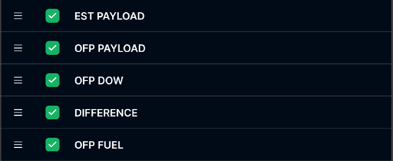

> **Phạm vi file:** Nội dung chức năng “Customize bảng biểu” được phân rã nguyên nghĩa từ Google Docs nguồn tại phạm vi chỉ mục 65115–68754. Không bổ sung hoặc suy diễn nghiệp vụ ngoài nguồn.

## **Customize bảng biểu**

| Tên chức năng: Table Setting |  |
| :---- | :---- |
| **Mục đích** | Cho phép user Customize bảng biểu |
| **Trigger** | Người dùng truy cập vào web TOSS \=\> nhấn module TOSS \=\> Chọn phân hệ Flight load control \=\> Chọn tab Fuel Order \=\> Chọn  |
| **Tiền điều kiện** | Người dùng đăng nhập thành công và được phân quyền phân hệ Flight load control |
| **Hậu điều kiện** | Hiển thị màn hình danh sách chuyến bay và thông tin Fuel Order khi user Customize  |
### **Sơ đồ luồng hệ thống**

### **Mô tả luồng xử lý**

| Bước | Chi tiết |
| :---: | :---- |
| 1 | Người dùng truy cập hệ thống TOSS \=\> Click module TOSS, chọn  phân hệ  Flight Load Control, sau đó chọn tab Fuel Order |
| 2 | Hệ thống gọi API và hiển thị danh sách chuyến bay và thông tin Fuel Order lên màn hình |
| 3 | Người dùng click button  |
| 4 | Hệ thống hiển thị Popup **Flight Monitoring table setting** (Hiển thị list toàn bộ các cột dữ liệu hiện có) |
| 5 | Người dùng thực hiện các thao tác thay đổi tham số cấu hình bảng: Kéo thả vị trí cột, bật/tắt hiển thị (Check/Uncheck) |
| 6 | Trường hợp người dùng nhấn nút \[Cancel\]: hệ thống đóng Popup, không lưu dữ liệu và giữ nguyên giao diện bảng hiện tại |
| 7 | Trường hợp người dùng nhấn nút \[Save\] \=\> Hệ thống lưu thông tin cấu hình bảng (Table view) vào DB |
| 8 | Hệ thống đóng Popup và áp dụng cấu hình vừa lưu để render lại danh sách chuyến bay và thông tin Fuel Order trên giao diện |
### **Màn hình chức năng**

   
### **Mô tả chi tiết màn hình**

| STT | Tên | Kiểu dữ liệu\[Độ dài\] | Mapping DB/API | Mô tả nghiệp vụ |
| ----- | :---: | :---: | :---: | ----- |
| **QUY TẮC LƯU CẤU HÌNH BẢNG** Cấu hình bảng (Customize View) được lưu theo **tài khoản User**. Khi User đăng nhập vào hệ thống (trên cùng hoặc thiết bị/trình duyệt khác), hệ thống tự động tải và áp dụng cấu hình bảng đã lưu gần nhất của User. Thao tác Logout/Login hoặc đăng nhập trên thiết bị/trình duyệt khác **không làm mất cấu hình bảng**. Nếu User chưa từng lưu cấu hình bảng, hệ thống hiển thị danh sách theo cấu hình mặc định. Khi User thực hiện lưu cấu hình mới, cấu hình cũ sẽ được ghi đè và áp dụng cho tất cả các phiên đăng nhập của User. **QUY TẮC CÁC CỘT LUÔN HIỂN THỊ       Phạm vi áp dụng:** 07 cột dữ liệu gồm: **EDD, FLT NO, ACREG, ACTYPE, ETD, DEP, ARR**. Tại danh sách chuyến bay: 07 cột trên luôn được hiển thị ở đầu bảng theo thứ tự từ trái sang phải. User không được phép ẩn, thay đổi vị trí hoặc cấu hình hiển thị đối với các cột này. Các cột không được ghim (pin) và cuộn ngang cùng với phần còn lại của bảng. Tại popup **Table Setting**: Không hiển thị 07 cột cố định trong danh sách **Data column name**. User chỉ được phép cấu hình các cột còn lại. |  |  |  |  |
| 1 | Title | Textview |  | Fix cứng text “Flight Monitoring table setting” Không cho thao tác |
| 2 |  | Icon |  | Click Button \=\> Đóng Popup, trở lại màn hình danh sách chuyến bay và thông tin Fuel Order |
| 3 | Data column name | Textview |  | Hiển thị tên danh sách tên các cột dữ liệu khả dụng của của bảng Fix cứng text, không cho thao tác |
|   |  |  |  |  |
| 4 |  | Icon |  | Cho phép người dùng nhấn giữ (hold) và kéo thả để thay đổi vị trí sắp xếp của các cột (Từ trên xuống tương đương Từ trái sang Phải) |
| 5 |        | Checkbox |  | Trạng thái mặc định: Chưa có cấu hình hoặc lần đầu Login: Tick chọn toàn bộ theo cấu hình gốc của hệ thống  Đã có cấu hình tùy chinh: Load trạng thái đồng bộ với cấu hình hiện tại của bảng (Cột đang hiển thị \-\> \[Check\], cột đang bị ẩn \-\> \[Uncheck\] ) Action Tick chọn: Hiển thị cột dữ liệu tương ứng trong bảng danh sách Bỏ tick: Ẩn cột dữ liệu tương ứng trong bảng danh sách |
| 6 |  | Button |  | Click \[Cancel\] \=\>Đóng Popup, trở lại màn hình danh sách chuyến bay và thông tin Fuel Order |
| 7 |  | Button |  | Click \[Button\]  \=\> Đóng Popup “FLight Monitoring table setting” Reload màn hình danh chuyến bay áp dụng theo cấu hình mới   |

   ###

---

**Nguồn trích:** [VNA.TOSS_SRS_Flight Load Control_v0.1](https://docs.google.com/document/d/1h5wsfTtU6sKJDIqZod2MKWhhjQTNB-BVEn5252n1ALs/edit) · Revision `ALtnJHw752QgcvhVUuNEE-hu5IMGBpSkN00WjYskJ9yEU_jTAh4oi9SCaz9AkZwFdMFX2SE4iKFybLDiZBdqCPcZtK6ptnEqmoPzVAMPTkU` · Google Docs index 65115–68754.
