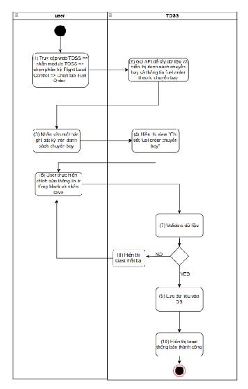
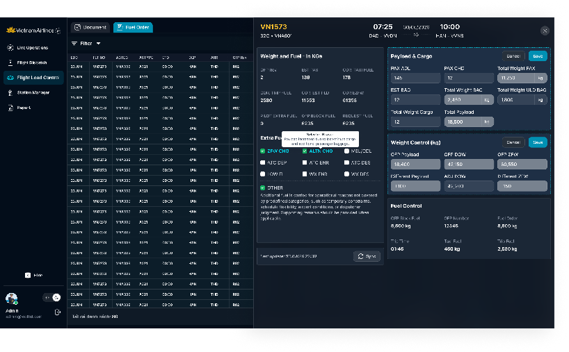
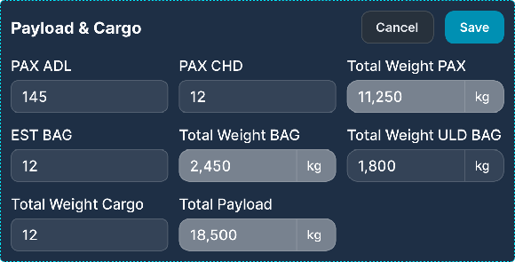
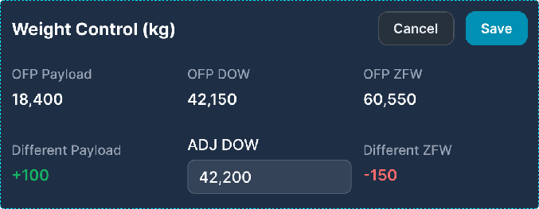
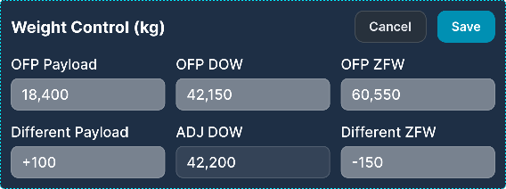

> **Phạm vi file:** Nội dung chức năng “Chỉnh sửa thông tin chi tiết fuel order” được phân rã nguyên nghĩa từ Google Docs nguồn tại phạm vi chỉ mục 51952–60120. Không bổ sung hoặc suy diễn nghiệp vụ ngoài nguồn.

## **Chỉnh sửa thông tin chi tiết fuel order**

| Tên chức năng: Chỉnh sửa thông tin chi tiết fuel order |  |
| :---- | :---- |
| **Mục đích** | Cho phép user chỉnh sửa thông tin chi tiết fuel order |
| **Trigger** | Người dùng truy cập vào web TOSS \=\> nhấn module TOSS \=\> Chọn phân hệ Flight load control \=\> Chọn tab Fuel Order \=\> Chọn 1 bản ghi chuyến bay \=\> Mở màn hình danh sách chuyến bày và fuel order |
| **Tiền điều kiện** | Người dùng đăng nhập thành công và được phân quyền phân hệ Flight Load Control |
| **Hậu điều kiện** | Người dùng chỉnh sửa thành công thông tin chi tiết fuel order |
### **Sơ đồ luồng hệ thống**

   
### **Mô tả luồng xử lý**

| Bước | Mô tả chi tiết luồng xử lý |
| ----- | ----- |
| 1 | Người dùng (User) truy cập vào hệ thống web TOSS \-\> nhấn module TOSS \-\> chọn phân hệ Flight Load Control \-\> chọn tab Fuel Order. |
| 2 | Hệ thống TOSS gọi API để lấy dữ liệu và hiển thị danh sách chuyến bay cùng thông tin fuel order theo ID chuyến bay. |
| 3 | Người dùng nhấn chọn vào một bản ghi bất kỳ trong danh sách chuyến bay để xem chi tiết. |
| 4 | Hệ thống TOSS hiển thị giao diện (View) *"Chi tiết fuel order chuyến bay"* đã chọn. |
| 5 | Người dùng thực hiện chỉnh sửa các thông tin tại từng khối dữ liệu (block) và nhấn nút Save để lưu lại. |
| 6 | Hệ thống TOSS thực hiện kiểm tra tính hợp lệ (Validate dữ liệu) của các thông tin vừa sửa. |
| 7 | Nếu Validate thất bại (Chọn NO):  Hệ thống hiển thị thông báo lỗi nhanh (Toast thất bại). Quay trở lại bước (5) để người dùng chỉnh sửa lại thông tin. |
| 8 | Nếu Validate thành công (Chọn YES):  Hệ thống thực hiện lưu dữ liệu mới vào cơ sở dữ liệu (DB). Hiển thị thông báo lưu thành công (Toast thành công) và kết thúc luồng xử lý. |
### **Màn hình chức năng**

### **Mô tả chi tiết màn hình**

| STT | Tên | Kiểu dữ liệu\[Độ dài\] | Mapping DB/API | Mô tả nghiệp vụ |
| ----- | ----- | ----- | ----- | ----- |
| **Block Payload & Cargo   ** Khi mới đồng bộ từ FZFW \=\> các trường PAX ADL, PAX CHD, EST BAG sẽ để trống Cho phép sửa các trường PAX ADL, PAX CHD, EST BAG, Total Weight Cargo,  Total Weight ULD BAG \=\> Hệ thống sẽ tính toán các trường còn lại theo công thức ([tham chiếu công thức)](https://docs.google.com/document/d/1h5wsfTtU6sKJDIqZod2MKWhhjQTNB-BVEn5252n1ALs/edit#bookmark=id.7q0jdp8lbx8j) |  |  |  |  |
| 1 | PAX ADL | Numberbox |  | Trường dữ liệu này chỉ được phép nhập bởi kiểm soát tải (KST)   Hiển thị theo dữ liệu API trả về Trường hợp API trả về rỗng/lỗi: Để trống trường Maxlength 20 ký tự. Chặn nếu nhập quá 20 ký tự Nếu paste dãy số \> 20 ký tự, chỉ nhận 20 ký tự đầu tiên Tự động TRIM Spaces đầu cuối khi out focus box Validate: Chỉ cho phép nhập giá trị\>=0, không cho phép nhập số thập phân  Trường hợp nội dung dài vượt quá độ rộng box \=\> Hiển thị…. và di chuột vào hiện tooltips hiển thị full nội dung Action: Không bắt buộc nhập khi có điện FZFW mới được đồng bộ về  Nếu đã nhập PAX ADL thì user bắt buộc phải nhập PAX CHD để tính toán **Total Weight Pax ⇒ nếu không nhập đầy đủ thì khi out focus/save hiển thị IM: “The PAX CHD field must not be empty”** Nhấn cancel \=\> Quay trở lại màn trước đó, dữ liệu không được lưu Nhấn save:  Nếu có điện FZFW mới được đồng bộ về trong quá trình user Edit thì hiển toast thông báo: “The data is no longer up to date. Please reload and try again.” Ngược lại \=\> Hiển thị toast thông báo chỉnh sửa thành công:  |
| 2 | PAX CHD | Numberbox |  | Trường dữ liệu này chỉ được phép nhập bởi kiểm soát tải (KST)   Hiển thị theo dữ liệu API trả về Trường hợp API trả về rỗng/lỗi: Để trống trường Maxlength 20 ký tự. Chặn nếu nhập quá 20 ký tự Nếu paste dãy số \> 20 ký tự, chỉ nhận 20 ký tự đầu tiên Tự động TRIM Spaces đầu cuối khi out focus box Validate: Chỉ cho phép nhập giá trị\>=0, không cho phép nhập số thập phân  Trường hợp nội dung dài vượt quá độ rộng box \=\> Hiển thị…. và di chuột vào hiện tooltips hiển thị full nội dung Action: Không bắt buộc nhập khi có điện FZFW mới được đồng bộ về  Nếu đã nhập PAX CHD thì user bắt buộc phải nhập PAX ADL để tính toán **Total Weight Pax ⇒ nếu không nhập đầy đủ thì khi out focus/save hiển thị IM: “The PAX ADL field must not be empty”** Nhấn cancel \=\> Quay trở lại màn trước đó, dữ liệu không được lưu Nhấn save:  Nếu có điện FZFW mới được đồng bộ về trong quá trình user Edit thì hiển toast thông báo: “The data is no longer up to date. Please reload and try again.” Ngược lại \=\> Hiển thị toast thông báo chỉnh sửa thành công:  |
| 3 | EST BAG | Numberbox |  | Trường dữ liệu này chỉ được phép nhập bởi kiểm soát tải (KST)   Hiển thị theo dữ liệu API trả về Trường hợp API trả về rỗng/lỗi: Để trống trường Maxlength 20 ký tự. Chặn nếu nhập quá 20 ký tự Nếu paste dãy số \> 20 ký tự, chỉ nhận 20 ký tự đầu tiên Tự động TRIM Spaces đầu cuối khi out focus box Validate: Chỉ cho phép nhập giá trị\>=0, không cho phép nhập số thập phân  Trường hợp nội dung dài vượt quá độ rộng box \=\> Hiển thị…. và di chuột vào hiện tooltips hiển thị full nội dung Action: Không bắt buộc nhập khi có điện FZFW mới được đồng bộ về  Nếu đã nhập EST BAG thì user bắt buộc phải nhập PAX CHD, PAX ADL để tính toán **Total Weight BAG ⇒ nếu không nhập đầy đủ thì khi out focus/save hiển thị IM đối với từng textbox PAX ADL, PAX CHD: “The \[PAX CHD\]/\[PAX CHD\] field must not be empty”** Nhấn cancel \=\> Quay trở lại màn trước đó, dữ liệu không được lưu Nhấn save:  Nếu có điện FZFW mới được đồng bộ về trong quá trình user Edit thì hiển toast thông báo: “The data is no longer up to date. Please reload and try again.” Ngược lại \=\> Hiển thị toast thông báo chỉnh sửa thành công:  |
| 4 | Total Weight Cargo | Numberbox |  | Trường dữ liệu này chỉ được phép nhập bởi Trung tâm hàng hóa/phục vụ hàng hóa (TTHH/PVHH) Dữ liệu [được cắt từ điện FZFW khi được đồng bộ về](https://docs.google.com/document/d/1h5wsfTtU6sKJDIqZod2MKWhhjQTNB-BVEn5252n1ALs/edit#bookmark=id.v4nk0ge17z7d) và fill vào trường này, cho phép user chỉnh sửa và dữ liệu Total Payload, Different Payload, Different ZFW sẽ thay đổi theo Hiển thị theo dữ liệu API trả về Trường hợp API trả về rỗng/lỗi: Để trống trường Maxlength 20 ký tự. Chặn nếu nhập quá 20 ký tự Nếu paste dãy số \> 20 ký tự, chỉ nhận 20 ký tự đầu tiên Tự động TRIM Spaces đầu cuối khi out focus box Validate: Chỉ cho phép nhập giá trị\>=0, không cho phép nhập số thập phân  Trường hợp nội dung dài vượt quá độ rộng box \=\> Hiển thị…. và di chuột vào hiện tooltips hiển thị full nội dung Action: Nhấn cancel \=\> Quay trở lại màn trước đó, dữ liệu không được lưu Nhấn save:  Nếu có điện FZFW mới được đồng bộ về trong quá trình user Edit thì hiển toast thông báo: “The data is no longer up to date. Please reload and try again.” Ngược lại \=\> Hiển thị toast thông báo chỉnh sửa thành công:  |
| 5 | Total Weight ULD BAG | Numberbox |  | Trường dữ liệu này chỉ được phép nhập bởi kiểm soát tải (KST)   Dữ liệu [được cắt từ điện FZFW khi được đồng bộ về](https://docs.google.com/document/d/1h5wsfTtU6sKJDIqZod2MKWhhjQTNB-BVEn5252n1ALs/edit#bookmark=id.v4nk0ge17z7d) và fill vào trường này, cho phép user chỉnh sửa và dữ liệu Total Payload, Different Payload, Different ZFW sẽ thay đổi theo Hiển thị theo dữ liệu API trả về Trường hợp API trả về rỗng/lỗi: Để trống trường Maxlength 20 ký tự. Chặn nếu nhập quá 20 ký tự Nếu paste dãy số \> 20 ký tự, chỉ nhận 20 ký tự đầu tiên Tự động TRIM Spaces đầu cuối khi out focus box Validate: Chỉ cho phép nhập giá trị\>=0, không cho phép nhập số thập phân  Trường hợp nội dung dài vượt quá độ rộng box \=\> Hiển thị…. và di chuột vào hiện tooltips hiển thị full nội dung Action: Nhấn cancel \=\> Quay trở lại màn trước đó, dữ liệu không được lưu Nhấn save:  Nếu có điện FZFW mới được đồng bộ về trong quá trình user Edit thì hiển toast thông báo: “The data is no longer up to date. Please reload and try again.” Ngược lại \=\> Hiển thị toast thông báo chỉnh sửa thành công:   |
| **Block:  Weight Control(Kg) **  |  |  |  |  |
| 6 | ADJ DOWN | Numberbox |  | Trường dữ liệu này do kiểm soát tải được phân quyền nhập nếu cần (nếu không nhập thì để trống trường này )  Hiển thị theo dữ liệu API trả về Trường hợp API trả về rỗng/lỗi: Để trống trường Maxlength 20 ký tự. Chặn nếu nhập quá 20 ký tự Nếu paste dãy số \> 20 ký tự, chỉ nhận 20 ký tự đầu tiên Tự động TRIM Spaces đầu cuối khi out focus box Validate: Chỉ cho phép nhập giá trị\>=0, không cho phép nhập số thập phân  Trường hợp nội dung dài vượt quá độ rộng box \=\> Hiển thị…. và di chuột vào hiện tooltips hiển thị full nội dung Action: Out focus \=\> Hiển thị dữ liệu vừa nhập Nhấn cancel \=\> Quay trở lại màn trước đó, dữ liệu không được lưu Nhấn save:  Nếu có điện FZFW mới được đồng bộ về trong quá trình user Edit thì hiển toast thông báo: “The data is no longer up to date. Please reload and try again.” Ngược lại \=\> Hiển thị toast thông báo chỉnh sửa thành công:     |

##

---

**Nguồn trích:** [VNA.TOSS_SRS_Flight Load Control_v0.1](https://docs.google.com/document/d/1h5wsfTtU6sKJDIqZod2MKWhhjQTNB-BVEn5252n1ALs/edit) · Revision `ALtnJHxfBcoS3ZX_dUDG4faiU2vNTN6jqfa11S8P3TtQKMoeCpKHAMIYbETn1t2y-MsETWV71PazYhsKeEIM4sMbm5GhpQLIcM5NXNTrqjk` · Google Docs index 51952–60120.
