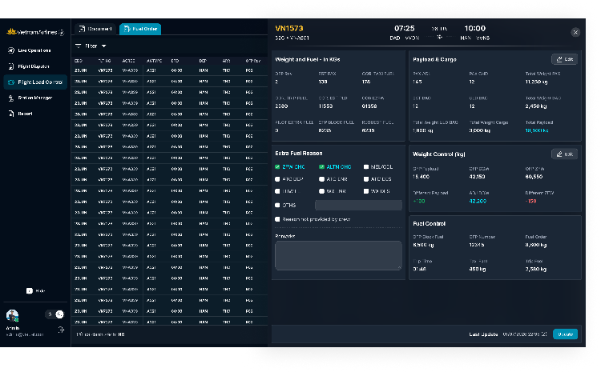
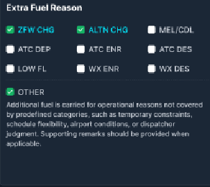
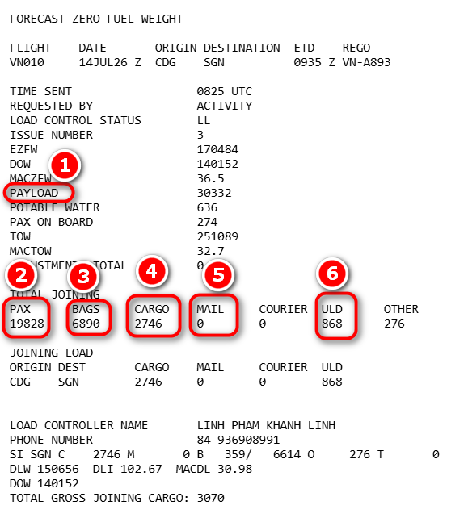
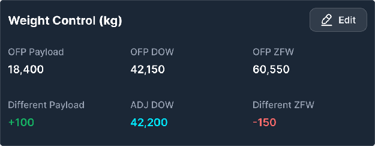
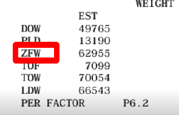
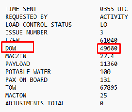
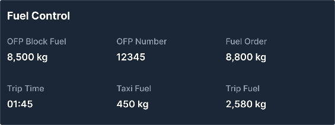
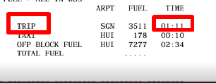
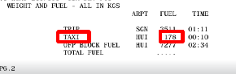
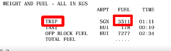

> **Phạm vi file:** Nội dung chức năng “Xem detail fuel chuyến bay” được phân rã nguyên nghĩa từ Google Docs nguồn tại phạm vi chỉ mục 35661–50256. Không bổ sung hoặc suy diễn nghiệp vụ ngoài nguồn.

## **Xem detail fuel chuyến bay**

| Tên chức năng: Xem details fuel chuyến bay |  |
| :---- | :---- |
| **Mục đích** | Cho phép user xem chi tiết fuel chuyến bay |
| **Trigger** | Người dùng truy cập vào web TOSS \=\> nhấn module TOSS \=\> Chọn phân hệ Flight load control \=\> Chọn tab Fuel Order \=\>Nhấp chọn vào 1 bản ghi  |
| **Tiền điều kiện** | Người dùng đăng nhập thành công và được phân quyền phân hệ Flight Load Control |
| **Hậu điều kiện** | Mở màn hình xem chi tiết fuel chuyến bay |
### **Sơ đồ luồng hệ thống**

### **Mô tả luồng xử lý**

| Bước | Chi tiết |
| :---: | :---- |
| 1 | Người dùng truy cập hệ thống TOSS \=\> Click module TOSS, chọn  phân hệ  Flight Load Control, sau đó chọn tab Fuel Order |
| 2 | Hệ thống gọi API để lấy dữ liệu và hiển thị danh sách chuyến bay cùng thông tin fuel lên màn hình |
| 3 | Người dùng nhấn chọn một bản ghi bất ký trên danh sách |
| 4 | Hệ thống hiển thị view “Chi tiết fuel chuyến bay”, tương ứng với bản ghi người dùng vừa thao tác |

####
### **Màn hình chức năng**

### **Mô tả chi tiết màn hình**

| STT | Tên | Kiểu dữ liệu\[Độ dài\] | Mapping DB/API | Mô tả nghiệp vụ |
| ----- | ----- | ----- | ----- | ----- |
|  |  |  |  |  |
| 1 |  | Label |  | Dữ liệu đồng bộ từ Netline ops++ Top: Hiển thị số hiệu chuyến bay  Bottom: Hiển thị ACREG \+ ACTYPE |
|  |  | Label |  | Dữ liệu đồng bộ từ Netline ops++ Hiển thị ngày cất cánh dự kiến   |
|  |  | Label |  | Dữ liệu đồng bộ từ Netline ops++ Top: Hiển thị giờ cất cánh dự kiến (ETD) Bottom: Hiển thị sân bay khởi hành theo định dạng IATA \- ICAO  |
|  |  | Label |  | Dữ liệu đồng bộ từ Netline ops++ Top: Hiển thị giờ hạ cánh dự kiến  Bottom: Hiển thị sân bay khởi hành theo định dạng IATA \- ICAO  |
|  |  | icon |  | Click icon x \=\> Quay trở lại màn hình danh sách và fuel chuyến bay |
| **Block:  Weight and Fuel \- In KGs**    |  |  |  |  |
|  | Weight and Fuel \- in KGs | Title |  | Hiển thị fix cứng text “Weight and Fuel \- in KGs” Bảng thể hiện các thông tin fuel khi PIC release trên MO plus  |
|  | OFP Rev  | Textview |  | OFP Rev: Hiển thị thông tin phiên bản OFP mới nhất được PIC confirm release Hiển thị \[OFP Rev \] theo dữ liệu API trả về Trường hợp API trả về rỗng/lỗi: Để trống trường Nếu độ dài dữ liệu vượt quá 2 dòng, hiển thị ba chấm \[...\] ở cuối dòng thứ 2 và có tooltip hiển thị toàn bộ nội dung |
|  | EST PAX  | Textview |  | EST PAX (Estimated Passenger \- Số lượng hành khách dự kiến) lấy từ Flight Release được PIC confirm release Hiển thị giá trị \[EST PAX\] theo dữ liệu API trả về.  Trường hợp API trả về rỗng/lỗi: Để trống trường Nếu độ dài dữ liệu vượt quá 2 dòng, hiển thị ba chấm \[...\] ở cuối dòng thứ 2 và có tooltip hiển thị toàn bộ nội dung |
|  | COR. TAXI FUEL   | Textview |  | COR. TAXI FUEL (Corrected Taxi Fuel \- Lượng nhiên liệu taxi sau khi hiệu chỉnh) lấy từ Flight Release được PIC confirm release Hiển thị giá trị \[COR. TAXI FUEL\] theo dữ liệu API trả về. Trường hợp API trả về rỗng/lỗi: Để trống trường Nếu độ dài dữ liệu vượt quá 2 dòng, hiển thị ba chấm \[...\] ở cuối dòng thứ 2 và có tooltip hiển thị toàn bộ nội dung |
|  | COR. TRIP FUEL   | Textview |  |  COR. TRIP FUEL (Corrected Trip Fuel \- Lượng nhiên liệu hành trình sau khi hiệu chỉnh) lấy từ Flight Release được PIC confirm release  Hiển thị giá trị \[COR. TRIP FUEL\] theo dữ liệu API trả về.  Trường hợp API trả về rỗng/lỗi: Để trống trường Nếu độ dài dữ liệu vượt quá 2 dòng, hiển thị ba chấm \[...\] ở cuối dòng thứ 2 và có tooltip hiển thị toàn bộ nội dung  |
|  | COR. EST PLD   | Textview |  | COR. EST PLD (Corrected Estimated Payload \- Tải trọng dự kiến sau khi hiệu chỉnh) lấy từ Flight Release được PIC confirm release Hiển thị giá trị \[COR. EST PLD\] theo dữ liệu API trả về.  Trường hợp API trả về rỗng/lỗi: Để trống trường Nếu độ dài dữ liệu vượt quá 2 dòng, hiển thị ba chấm \[...\] ở cuối dòng thứ 2 và có tooltip hiển thị toàn bộ nội dung |
|  | COR.EZFW   | Textview |  | COR. EZFW (Corrected Estimated Zero Fuel Weight \- Khối lượng không nhiên liệu dự kiến sau khi hiệu chỉnh) lấy từ Flight Release được PIC confirm release Hiển thị giá trị \[COR. EZFW\] theo dữ liệu API trả về.  Trường hợp API trả về rỗng/lỗi: Để trống trường Nếu độ dài dữ liệu vượt quá 2 dòng, hiển thị ba chấm \[...\] ở cuối dòng thứ 2 và có tooltip hiển thị toàn bộ nội dung  |
|  | PILOT EXTRA FUEL   | Textview |  |  PILOT EXTRA FUEL (Pilot Extra Fuel \- Lượng nhiên liệu bổ sung do tổ lái yêu cầu) lấy từ Flight Release được PIC confirm release  Hiển thị giá trị \[PILOT EXTRA FUEL\] theo dữ liệu API trả về.  Trường hợp API trả về rỗng/lỗi: Để trống trường Nếu độ dài dữ liệu vượt quá 2 dòng, hiển thị ba chấm \[...\] ở cuối dòng thứ 2 và có tooltip hiển thị toàn bộ nội dung  |
|  | OFP BLOCK FUEL   | Textview |  | OFP BLOCK FUEL lấy từ Flight Release được PIC confirm release.  Hiển thị giá trị \[OFP BLOCK FUEL\] theo dữ liệu API trả về.  Trường hợp API trả về rỗng/lỗi: Để trống trường Nếu độ dài dữ liệu vượt quá 2 dòng, hiển thị ba chấm \[...\] ở cuối dòng thứ 2 và có tooltip hiển thị toàn bộ nội dung |
|  | REQUEST FUEL   | Textview |  | REQUEST FUEL (Requested Fuel \- Lượng nhiên liệu yêu cầu nạp)  lấy từ Flight Release được PIC confirm release  Hiển thị giá trị \[REQUEST FUEL\] theo dữ liệu API trả về.  Trường hợp API trả về rỗng/lỗi: Để trống trường Nếu độ dài dữ liệu vượt quá 2 dòng, hiển thị ba chấm \[...\] ở cuối dòng thứ 2 và có tooltip hiển thị toàn bộ nội dung  |
| **Block: Extra fuel reason**  Dữ liệu ở block này được đồng bộ từ MO về khi PIC confirm release  |  |  |  |  |
|  | Extra fuel reason | Title |  | Hiển thị fix cứng text “Extra fuel reason” |
|  | Nội dung |  |  | Bao gồm các checkbox nguyên nhân được đồng bộ từ MO về khi PIC confirm release ZFW CHG ALTN CHG ATC NOTAM VIP LOWFL WX ALT WX DES LONG TAXI WX ENR TANKERING MEL-CDL OTHER User hover chuột vào  được tick chọn bên MO màu xanh) \=\> Hiển thị tooltip toàn bộ nội dung  Với trường OTHER \=\> Dữ liệu API trả về vượt quá độ rộng ô thì hiển thị … ở cuối dòng và có.tooltips toàn bộ nội dung  |
|  **Dữ liệu ở block này được bóc tách từ điện FZFW theo cơ chế bắn mail về hòm thư từ Amadeus. [Tham chiếu cơ chế mapping chuyến bay ở điện với chuyến bay TOSS để thực hiện bóc tách](https://docs.google.com/spreadsheets/d/19GpwQX8gxu383c5bzANVM-vyWLwFwODzZ3QG_fRqsO8/edit?pli=1&gid=842563127#gid=842563127) Bóc tách dữ liệu  Trường dữ liệu trên TOSS Dữ liệu điện FZFW Total Payload Cắt dữ liệu (1) fill vào trường này Total Weight Pax Cắt dữ liệu (2) fill vào trường này  Total Weight BAG Cắt dữ liệu (3) fill vào trường này Total Weight Cargo Lấy (4) \+  (5) \=\> Fill dữ liệu vào trường này Total Weight ULD BAG Cắt dữ liệu (6) fill vào trường này** Mỗi khi có điện FZFW mới được đồng bộ từ Amadeus về:  Hệ thống sẽ tự động bóc tách và fill vào các trường Total Payload, Total Weight Pax, Total Weight BAG, Total Weight Cargo, Total Weight ULD BAG Đồng thời các trường PAX ADL, PAX CHD, EST BAG sẽ bị clear thông tin và để trống trường giá trị Cho phép user nhập tay các trường PAX ADL, PAX CHD, EST BAG khi click Edit Công thức tính:  **Total Weight Pax \=** PAX ADL \*75 \+ PAX CHD \*35 **Total Weight BAG \=** EST BAG \* (PAX ALD \+ PAX CHD) **Total Payload \= Total Weight Pax \+ Total Weight BAG \+ Total Weight Cargo** \+ **Total Weight ULD BAG**  |  |  |  |  |
|  | Payload & Cargo | Title |  | Hiển thị fix cứng text “Payload & Cargo”  |
|  | PAX ADL   | Number |  | Hiển thị số lượng hành khách người lớn Hiển thị \[PAX ADL\] theo dữ liệu API trả về Giá trị phải \>=0 Trường hợp API trả về rỗng/lỗi: Để trống trường Nếu độ dài dữ liệu vượt quá 2 dòng, hiển thị ba chấm \[...\] ở cuối dòng thứ 2 và có tooltip hiển thị toàn bộ nội dung |
|  | PAX CHD  | Number |  | Hiển thị số lượng hành khách trẻ em Hiển thị \[PAX CHD\] theo dữ liệu API trả về Giá trị phải \>=0 Trường hợp API trả về rỗng/lỗi: Để trống trường Nếu độ dài dữ liệu vượt quá 2 dòng, hiển thị ba chấm \[...\] ở cuối dòng thứ 2 và có tooltip hiển thị toàn bộ nội dung |
|  | EST BAG  | Number |  | Hiển thị số lượng hành lý dự kiến  Hiển thị \[EST BAG\] theo dữ liệu API trả về Giá trị phải \>=0 Trường hợp API trả về rỗng/lỗi: Để trống trường Nếu độ dài dữ liệu vượt quá 2 dòng, hiển thị ba chấm \[...\] ở cuối dòng thứ 2 và có tooltip hiển thị toàn bộ nội dung |
|  | Total Payload | Number |  | Hiển thị tổng trọng lượng của toàn bộ hành khách  Hiển thị \[Total Payload\] theo dữ liệu API trả về Giá trị phải \>=0 Trường hợp API trả về rỗng/lỗi: Để trống trường Nếu độ dài dữ liệu vượt quá 2 dòng, hiển thị ba chấm \[...\] ở cuối dòng thứ 2 và có tooltip hiển thị toàn bộ nội dung  |
|  | Total Weight Pax | Number |  | Hiển thị tổng trọng lượng của toàn bộ hành khách  Hiển thị \[Total Weight Pax\] theo dữ liệu API trả về Giá trị phải \>=0 Trường hợp API trả về rỗng/lỗi: Để trống trường Nếu độ dài dữ liệu vượt quá 2 dòng, hiển thị ba chấm \[...\] ở cuối dòng thứ 2 và có tooltip hiển thị toàn bộ nội dung |
|  | Total Weight BAG | Number |  | Hiển thị tổng trọng lượng của hành lý ký gửi.  Hiển thị \[Total Weight BAG\] theo dữ liệu API trả về Giá trị phải \>=0 Trường hợp API trả về rỗng/lỗi: Để trống trường Nếu độ dài dữ liệu vượt quá 2 dòng, hiển thị ba chấm \[...\] ở cuối dòng thứ 2 và có tooltip hiển thị toàn bộ nội dung |
|  | Total Weight Cargo | Number |  | Hiển thị tổng trọng lượng hàng hóa vận chuyển Hiển thị \[Total Weight Cargo\] theo dữ liệu API trả về Giá trị phải \>=0 Trường hợp API trả về rỗng/lỗi: Để trống trường Nếu độ dài dữ liệu vượt quá 2 dòng, hiển thị ba chấm \[...\] ở cuối dòng thứ 2 và có tooltip hiển thị toàn bộ nội dung |
|  | Total Weight ULD BAG | Number |  | Hiển thị tổng trọng lượng hành lý được xếp trong ULD Hiển thị \[Total Payload\] theo dữ liệu API trả về Giá trị phải \>=0 Trường hợp API trả về rỗng/lỗi: Để trống trường Nếu độ dài dữ liệu vượt quá 2 dòng, hiển thị ba chấm \[...\] ở cuối dòng thứ 2 và có tooltip hiển thị toàn bộ nội dung |
| Block: Weight Control(Kg)  |  |  |  |  |
|  | Weight Control(Kg)  | Title |  | Hiển thị fix cứng text “Weight Control(Kg)” |
|  | OFP Payload | Number |  | Gía trị OFP Payload được bóc tách từ trường PLD trong OFP phiên bản mới nhất  Hiển thị \[OFP Payload\] theo dữ liệu API trả về Giá trị phải \>=0 Trường hợp API trả về rỗng/lỗi: Để trống trường Nếu độ dài dữ liệu vượt quá 2 dòng, hiển thị ba chấm \[...\] ở cuối dòng thứ 2 và có tooltip hiển thị toàn bộ nội dung |
|  | OFP DOW | Number |  | Gía trị OFP DOW được bóc tách từ trường DOW trong OFP phiên bản mới nhất  Hiển thị \[OFP DOW\] theo dữ liệu API trả về Giá trị phải \>=0 Trường hợp API trả về rỗng/lỗi: Để trống trường Nếu độ dài dữ liệu vượt quá 2 dòng, hiển thị ba chấm \[...\] ở cuối dòng thứ 2 và có tooltip hiển thị toàn bộ nội dung |
|  | OFP ZFW | Number |  | Gía trị OFP ZFW được bóc tách từ trường ZFW trong OFP phiên bản mới nhất  Hiển thị \[OFP ZFW\] theo dữ liệu API trả về Giá trị phải \>=0 Trường hợp API trả về rỗng/lỗi: Để trống trường Nếu độ dài dữ liệu vượt quá 2 dòng, hiển thị ba chấm \[...\] ở cuối dòng thứ 2 và có tooltip hiển thị toàn bộ nội dung |
|  | Different Payload | Textview |  | Gía trị hiển thị sự chênh lệch giữa trọng tải thực tế xếp lên máy bay (Total Payload) và trọng tải dự kiến trong kế hoạch bay (OFP Payload) Hiển thị \[Different Payload\] theo dữ liệu API trả về Giá trị được tính bằng công thức: [Total Payload](https://docs.google.com/document/d/1h5wsfTtU6sKJDIqZod2MKWhhjQTNB-BVEn5252n1ALs/edit#bookmark=id.v4nk0ge17z7d) \- [OFP Payload](https://docs.google.com/document/d/1h5wsfTtU6sKJDIqZod2MKWhhjQTNB-BVEn5252n1ALs/edit#bookmark=id.h38ro3yglpiw) Gía trị được lấy nguyên bản: nếu kết quả ra số âm thì hiển thị dấu “-” phía trước và màu đỏ ( ví dụ: \-23). Nếu kết quả ra số dương thì hiển thị dấu “+” phía trước và màu xanh (ví dụ: \+300) Trường hợp API trả về rỗng/lỗi: Để trống trường Nếu độ dài dữ liệu vượt quá 2 dòng, hiển thị ba chấm \[...\] ở cuối dòng thứ 2 và có tooltip hiển thị toàn bộ nội dung |
|  | ADJ DOW | Textview |  | Là trọng lượng thực tế của chiếc máy bay khô rỗng sau khi đã cộng/trừ các thay đổi phát sinh ở giờ chót.  Dữ liệu được bóc tách từ trường DOW trong điện FZFW:  Hiển thị \[ADJ DOW\] theo dữ liệu API trả về Trường hợp API trả về rỗng/lỗi: Để trống trường Nếu độ dài dữ liệu vượt quá 2 dòng, hiển thị ba chấm \[...\] ở cuối dòng thứ 2 và có tooltip hiển thị toàn bộ nội dung  |
|  | Different ZFW | Textview |  | Gía trị hiển thị sự chênh lệch giữa trọng lượng khô rỗng khi chưa có dầu theo thực tế và kế hoạch Hiển thị \[Different Payload\] theo dữ liệu API trả về Giá trị được tính bằng công thức: [Total Payload](https://docs.google.com/document/d/1h5wsfTtU6sKJDIqZod2MKWhhjQTNB-BVEn5252n1ALs/edit#bookmark=id.v4nk0ge17z7d) \+ [OFP DOW](https://docs.google.com/document/d/1h5wsfTtU6sKJDIqZod2MKWhhjQTNB-BVEn5252n1ALs/edit#bookmark=id.b4kzs4i20k8v)/[ADJ DOW](https://docs.google.com/document/d/1h5wsfTtU6sKJDIqZod2MKWhhjQTNB-BVEn5252n1ALs/edit#bookmark=id.i5r2xnj6q3hf) \- [OFP ZFW](https://docs.google.com/document/d/1h5wsfTtU6sKJDIqZod2MKWhhjQTNB-BVEn5252n1ALs/edit#bookmark=id.lfhwiqkvxzn5) **Nếu có ADJ DOW thì công thức sẽ ưu tiên dùng ADJ DOW** Gía trị được lấy nguyên bản: nếu kết quả ra số âm thì hiển thị dấu “-” phía trước và màu đỏ ( ví dụ: \-23). Nếu kết quả ra số dương thì hiển thị dấu “+” phía trước và màu xanh (ví dụ: \+300) Trường hợp API trả về rỗng/lỗi: Để trống trường Nếu độ dài dữ liệu vượt quá 2 dòng, hiển thị ba chấm \[...\] ở cuối dòng thứ 2 và có tooltip hiển thị toàn bộ nội dung |
| **Block: FUEL CONTROL**  |  |  |  |  |
|  | OFP Block Fuel | Number |  | OFP Block Fuel: Hiển thị thông tin tổng lượng nhiên liệu Block của chuyến bay theo OFP. . Đơn vị (Kg). Bóc tách từ trường **BLOCK FUEL** cột FUEL trong OFP phiên bản mới nhất. Hiển thị **\[OFP BLOCK FUEL\]** theo dữ liệu API trả về. Trường hợp API trả về rỗng/lỗi: để trống trường. Nếu độ dài dữ liệu vượt quá 2 dòng, hiển thị ba chấm **\[…\]** ở cuối dòng thứ 2 và có tooltip hiển thị toàn bộ nội dung. |
|  | OFP Number | Number |  | OFP Number: Hiển thị mã định danh của tài liệu OFP Bóc tách từ trường **OFP Number** trong OFP phiên bản mới nhất.  Hiển thị **\[OFP NUMBER\]** theo dữ liệu API trả về. Trường hợp API trả về rỗng/lỗi: để trống trường. Nếu độ dài dữ liệu vượt quá 2 dòng, hiển thị ba chấm **\[…\]** ở cuối dòng thứ 2 và có tooltip hiển thị toàn bộ nội dung.  |
|  | Fuel Order | Number |  | Fuel Order: Hiển thị lượng nhiên liệu yêu cầu nạp. Đơn vị (Kg). Bóc tách từ trường REQUEST FUEL khi PIC confirm release phiên bản OFP mới nhất Hiển thị **\[FUEL ORDER\]** theo dữ liệu API trả về. Trường hợp API trả về rỗng/lỗi: để trống trường. Nếu độ dài dữ liệu vượt quá 2 dòng, hiển thị ba chấm **\[…\]** ở cuối dòng thứ 2 và có tooltip hiển thị toàn bộ nội dung.  |
|  | Trip Time | Datetime |  | Trip Time: Hiển thị thời gian bay dự kiến. Định dạng hiển thị: **HH:mm**. Bóc tách từ trường TRIP cột TIME trong OFP phiên bản mới nhất  Hiển thị **\[TRIP TIME\]** theo dữ liệu API trả về. Trường hợp API trả về rỗng/lỗi: để trống trường. Nếu độ dài dữ liệu vượt quá 2 dòng, hiển thị ba chấm **\[…\]** ở cuối dòng thứ 2 và có tooltip hiển thị toàn bộ nội dung.  |
|  | Taxi Fuel | Number |  | Taxi Fuel: Hiển thị lượng nhiên liệu sử dụng trong giai đoạn taxi. Đơn vị (Kg). Bóc tách từ trường TAXI cột FUEL từ OFP mới nhất   Hiển thị **\[TAXI FUEL\]** theo dữ liệu API trả về. Trường hợp API trả về rỗng/lỗi: để trống trường. Dữ liệu trong cột hiển thị thông tin lượng nhiên liệu taxi của chuyến bay. Nếu độ dài dữ liệu vượt quá 2 dòng, hiển thị ba chấm **\[…\]** ở cuối dòng thứ 2 và có tooltip hiển thị toàn bộ nội dung.  |
|  | Trip Fuel | Number |  | Trip Fuel: Hiển thị lượng nhiên liệu tiêu thụ trong hành trình. Đơn vị (Kg). Bóc tách từ trường TRIP cột FUEL trong OFP phiên bản mới nhất  Hiển thị **\[TRIP FUEL\]** theo dữ liệu API trả về. Trường hợp API trả về rỗng/lỗi: để trống trường. Dữ liệu trong cột hiển thị thông tin lượng nhiên liệu hành trình của chuyến bay. Nếu độ dài dữ liệu vượt quá 2 dòng, hiển thị ba chấm **\[…\]** ở cuối dòng thứ 2 và có tooltip hiển thị toàn bộ nội dung.  |

##

---

**Nguồn trích:** [VNA.TOSS_SRS_Flight Load Control_v0.1](https://docs.google.com/document/d/1h5wsfTtU6sKJDIqZod2MKWhhjQTNB-BVEn5252n1ALs/edit) · Revision `ALtnJHxtgop8tqU1H4gOvgIdTgE39wuW0tXeTq11SiDids1CLuKzRUNhr3GxQkpotgiqrqrdOBQNUeCsjS--F24FhdUDJiRoJFzN8MNoC2k` · Google Docs index 35661–50256.
