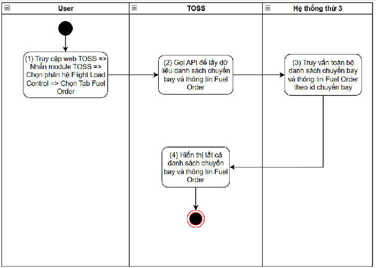
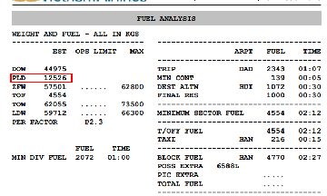
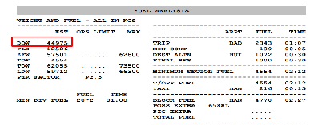
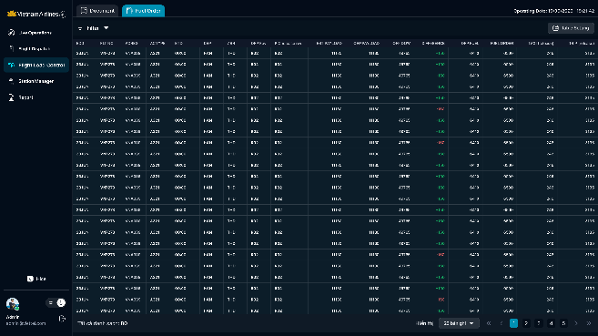

> **Phạm vi file:** Nội dung chức năng “Xem danh sách chuyến bay và thông tin fuel order” được phân rã nguyên nghĩa từ Google Docs nguồn tại phạm vi chỉ mục 27567–36130. Không bổ sung hoặc suy diễn nghiệp vụ ngoài nguồn.

## **Xem danh sách chuyến bay và thông tin fuel order**

| Tên chức năng: Xem danh sách chuyến bay và thông tin fuel order  |  |
| :---- | :---- |
| **Mục đích** | Cho phép user xem danh sách chuyến bay và thông tin fuel order |
| **Trigger** | Người dùng truy cập vào web TOSS \=\> nhấn module TOSS \=\> Chọn phân hệ Flight load control \=\> Chọn tab Fuel Order |
| **Tiền điều kiện** | Người dùng đăng nhập thành công và được phân quyền phân hệ Flight load control |
| **Hậu điều kiện** | Mở màn hình danh sách chuyến bay và thông tin fuel order đối với từng chuyến bay |
### **Sơ đồ luồng hệ thống**

### **Mô tả luồng xử lý**

| Bước | Chi tiết |
| :---: | :---- |
| 1 | Người dùng truy cập hệ thống TOSS \=\> Click module TOSS, chọn  phân hệ  Flight Load Control, sau đó chọn tab Fuel Order |
| 2 | Hệ thống gọi API lấy đữ liệu danh sách toàn bộ chuyến bay và thông tin Fuel Order |
| 3 | Đồng bộ danh sách chuyến bay từ Netline: Trường hợp data trả ra \# null \-\> có bản ghi danh sách chuyến bay, hiển thị bảng danh sách chuyến bay theo ngày, mặc định \= ngày hiện tại, sắp xếp giảm dần theo ETD trong cùng 1 ngày   Trường hợp data trả ra \= null \-\> không có bản ghi danh sách chuyến bay, hiển thị bảng danh sách chuyến bay trống kèm text “ No data”. Trường hợp lỗi đồng bộ từ Netline trong quá trình xử lý \=\> Hiển thị toast:  “*An error has occurred, please try again”* **Cơ chế tự động cập nhật dữ liệu** Khi MO có phiên bản OFP mới nhất \=\> Hệ thống TOSS sẽ đồng bộ hiển thị Rev của OFP mới nhất, đồng thời  mapping chuyến bay và [bóc tách](https://docs.google.com/document/d/1h5wsfTtU6sKJDIqZod2MKWhhjQTNB-BVEn5252n1ALs/edit#bookmark=id.jo9zs5p15n8s) dữ liệu tự động fill vào 2 trường OFP PAYLOAD OFP DOW Khi PIC confirm release OFP \=\>  Hệ thống sẽ [đồng bộ dữ liệu từ MO](https://docs.google.com/document/d/1h5wsfTtU6sKJDIqZod2MKWhhjQTNB-BVEn5252n1ALs/edit#bookmark=id.kmw54tf23c56) tự động fill vào 5 trường PIC Release Rev (Cập nhật số phiên bản mới nhất) OFP FUEL  FUEL ORDER  TAXI  TRIP  Bóc tách dữ liệu OFP OFP PAYLOAD: Bóc tách từ trường PLD trong OFP phiên bản mới nhất  OFP DOW : Được bóc tách từ trường DOW trong OFP phiên bản mới nhất  Đồng bộ dữ liệu Flight Release mà PIC release mới nhất PIC release rev :Hiển thị thông tin phiên bản OFP mà PIC release  mới nhất từ MO về OFP FUEL :  lấy giá trị OFP BLOCK FUEL ở Flight Release mà PIC release mới nhất FUEL ORDER: lấy giá trị REQUEST FUEL ở bản Flight Release mà PIC release mới nhất TAXI (release): lấy giá trị COR.TAXI FUEL ở bản Flight Release mà PIC release mới nhất TRIP (release) : lấy giá trị COR.TRIP FUEL ở bản Flight Release mà PIC release mới nhất |
| 4 | Hiển thị danh sách chuyến bay và  thông tin fuel order của chuyến bay tương ứng |

####
### **Màn hình chức năng**

   
### **Mô tả chi tiết màn hình**

| STT | Tên | Kiểu dữ liệu\[Độ dài\] | Mapping DB/API | Mô tả nghiệp vụ |
| ----- | ----- | ----- | ----- | ----- |
| FE call API lấy danh sách chuyến bay và thông tin Fuel Order  mới nhất hiển thị trên màn hình.  Các cột thông tin trên màn danh sách Các cột thông tin đồng bộ từ Netline ops \++ theo cơ chế \+-3 ngày, \+-30 ngày 5p/lần EDD FLT NO  ACREG  ACTYPE  ETD  DEP  ARR  Cột OFP Rev: Đồng bộ phiên bản OFP mới nhất từ MO (đồng bộ realtime) Các cột thông tin được đông bộ từ MO thuộc bản PIC release mới nhất PIC release rev OFP Fuel Fuel Order TAXI  TRIP  Cột EST PAYLOAD: Hiển thị thông tin EST PAYLOAD được nhập từ màn chi tiết  Các cột thông tin hiển thị (dựa trên dữ liệu bóc tách từ bản OFP mới nhất từ MO) OFP PAYLOAD OFP DOW  |  |  |  |  |
| 1 | EDD | Datetime |  | EDD: Ngày dự kiến khởi hành   Hiển thị \[EDD \] theo dữ liệu API trả về Định dạng: ddMMM ( ví dụ: 23JUN) Trường hợp API trả về rỗng/lỗi: để trống trường |
| 2 | FLT NO  | Textview |  | FLIGHT: Số hiệu chuyến bay Hiển thị \[FLT NO \] theo dữ liệu API trả về Trường hợp API trả về rỗng/lỗi: để trống trường Dữ liệu trong cột hiển thị thông tin số hiệu của chuyến bay |
| 3 | ACREG | Textview |  | ACREG: Số hiệu đăng ký chuyến bay Hiển thị \[ACREG \] theo dữ liệu API trả về Trường hợp API trả về rỗng/lỗi: để trống trường Dữ liệu trong cột hiển thị thông tin số hiệu đăng ký của chuyến bay |
| 4 | ACTYPE | Textview |  | ACTYPE: Loại tàu bay  Hiển thị \[ACTYPE \] theo dữ liệu API trả về Trường hợp API trả về rỗng/lỗi: để trống trường Dữ liệu trong cột hiển thị thông tin loại tàu bay của chuyến bay |
| 5 | ETD | Textview |  | ETD: Thời gian cất cánh dự kiến Hiển thị \[ETD\] theo dữ liệu API trả về Trường hợp API trả về rỗng/lỗi: để trống trường  Cấu trúc hiển thị: giờ \- phút (hh:mm) |
| 6 | DEP | Textview |  |  DEP: Hiển thị thông tin Điểm đi Hiển thị \[DEP\] theo dữ liệu API trả về Trường hợp API trả về rỗng/lỗi: để trống trường Dữ liệu trong cột hiển thị thông tin Điểm đi của máy bay Hiển thị dưới dạng viết tắt của điểm đi |
| 7 | ARR | Textview |  | ARR: Hiển thị thông tin Điểm đến Hiển thị \[ARR \] theo dữ liệu API trả về Trường hợp API trả về rỗng/lỗi: để trống trường Dữ liệu trong cột hiển thị thông tin Điểm đến Hiển thị dưới dạng viết tắt của điểm đến |
| 8 | OFP Rev | Textview |  | OFP Rev: Hiển thị thông tin phiên bản OFP mới nhất được đồng bộ từ MO về Hiển thị \[OFP Rev \] theo dữ liệu API trả về Trường hợp API trả về rỗng/lỗi: để trống trường Dữ liệu trong cột hiển thị thông tin phiên bản OFP mới nhất |
| 9 | PIC release rev | Textview |  | PIC release rev: Hiển thị thông tin phiên bản PIC release  mới nhất từ MO Hiển thị \[PIC release rev \] theo dữ liệu API trả về Trường hợp API trả về rỗng/lỗi: để trống trường Nếu độ dài dữ liệu vượt quá 2 dòng, hiển thị ba chấm \[…\] ở cuối dòng thứ 2 và có tooltip hiển thị toàn bộ nội dung |
| 10 | EST PAYLOAD  | Numer |  | EST PAYLOAD: Hiển thị Tải trọng dự kiến do KST nhập/ gửi. Đơn vị (**Kg**) Gía trị lấy từ trường TOTAL PAYLOAD trong màn chi tiết Hiển thị \[EST PAYLOAD\] theo dữ liệu API trả về Trường hợp API trả về rỗng/lỗi: để trống trường  Nếu độ dài dữ liệu vượt quá 2 dòng, hiển thị ba chấm \[…\] ở cuối dòng thứ 2 và có tooltip hiển thị toàn bộ nội dung |
| 11 | OFP PAYLOAD | Number |  | OFP PAYLOAD: Hiển thị Tải trọng dự kiến trên OFP. Đơn vị (**Kg**) Bóc tách từ trường PLD trong OFP phiên bản mới nhất  Hiển thị \[OFP PAYLOAD\] theo dữ liệu API trả về Trường hợp API trả về rỗng/lỗi: để trống trường  Dữ liệu trong cột hiển thị thông tin Tải trọng dự kiến trên OFP Nếu độ dài dữ liệu vượt quá 2 dòng, hiển thị ba chấm \[…\] ở cuối dòng thứ 2 và có tooltip hiển thị toàn bộ nội dung |
| 12 | OFP DOW | Number |  | OFP DOW: Trọng lượng cơ sở của tàu bay đã sẵn sàng để thực hiện chuyến bay. Đơn vị (**Kg**) Bóc tách từ trường DOW trong OFP phiên bản mới nhất   Hiển thị \[OFP DOW\] theo dữ liệu API trả về Trường hợp API trả về rỗng/lỗi: để trống trường  Dữ liệu trong cột hiển thị thông tin Trọng lượng cơ sỏ của tàu bay  Nếu độ dài dữ liệu vượt quá 2 dòng, hiển thị ba chấm \[…\] ở cuối dòng thứ 2 và có tooltip hiển thị toàn bộ nội dung |
| 13 | DIFFERENCE | Textview |  | Hiển thị Chênh lệch tải trọng. Đơn vị (Kg) Hệ thống tự động tính toán theo công thức DIFFERENCE \= EST PAYLOAD \- OFP PAYLOAD để hiển thị ra màn hình Gía trị được lấy nguyên bản: nếu kết quả ra số âm thì hiển thị dấu “-” phía trước và màu đỏ ( ví dụ: \-23). Nếu kết quả ra số dương thì hiển thị dấu “+” phía trước và màu xanh (ví dụ: \+300) Trường hợp API trả về rỗng/lỗi, HOẶC một trong hai trường dữ liệu gốc (EST PAYLOAD, OFP PAYLOAD) bị rỗng: Để trống trường Nếu độ dài dữ liệu vượt quá 2 dòng, hiển thị ba chấm \[...\] ở cuối dòng thứ 2 và có tooltip hiển thị toàn bộ nội dung |
| 14 | OFP FUEL | Textview |  | Hiển thị dầu dự kiến trên OFP. Đơn vị (Kg) Lấy giá trị OFP BLOCK FUEL từ bản Flight Release mà PIC release mới nhất Hiển thị \[OFP FUEL\]  theo dữ liệu API trả về Trường hợp API trả về rỗng/lỗi: để trống trường  Nếu độ dài dữ liệu vượt quá 2 dòng, hiển thị ba chấm \[…\] ở cuối dòng thứ 2 và có tooltip hiển thị toàn bộ nội dung |
| 15 | FUEL ORDER  | Textview |  | Hiển thị số dầu mà PIC request. Đơn vị (Kg) Hiển thị \[FUEL ORDER \]  theo dữ liệu API trả về Lấy giá trị REQUEST FUEL từ bản Flight Release mà PIC release mới nhất Trường hợp API trả về rỗng/lỗi: để trống trường  Nếu độ dài dữ liệu vượt quá 2 dòng, hiển thị ba chấm \[…\] ở cuối dòng thứ 2 và có tooltip hiển thị toàn bộ nội dung |
| 16 | TAXI (release)  | Textview |  | Hiển thị Taxi Fuel. Đơn vị (Kg) Hiển thị \[TAXI\]  theo dữ liệu API trả về Lấy giá trị COR.TAXI FUEL từ bản Flight Release mà PIC release mới nhất Trường hợp API trả về rỗng/lỗi: để trống trường  Dữ liệu trong cột hiển thị thông tin Taxi Fuel Nếu độ dài dữ liệu vượt quá 2 dòng, hiển thị ba chấm \[…\] ở cuối dòng thứ 2 và có tooltip hiển thị toàn bộ nội dung |
| 17 | TRIP (release)  | Textview |  | Hiển thị Trip Fuel. Đơn vị (Kg) Hiển thị \[TRIP\]  theo dữ liệu API trả về Lấy giá trị COR.TRIP FUEL từ bản Flight Release mà PIC release mới nhất Trường hợp API trả về rỗng/lỗi: để trống trường  Nếu độ dài dữ liệu vượt quá 2 dòng, hiển thị ba chấm \[…\] ở cuối dòng thứ 2 và có tooltip hiển thị toàn bộ nội dung |
|  | Phân trang |  |  | [Tham chiếu kịch bản phân trang](https://docs.google.com/document/d/1L5y0t4FCWe_vnNI65xNMRC-LM3lvLwYsQRAm_Nokv9A/edit?tab=t.0#heading=h.siw2lr5eha4t)  Số bản ghi/trang có thể lựa chọn gồm:  25, 50  Số lượng bản ghi/trang mặc định \= 25  |

##

---

**Nguồn trích:** [VNA.TOSS_SRS_Flight Load Control_v0.1](https://docs.google.com/document/d/1h5wsfTtU6sKJDIqZod2MKWhhjQTNB-BVEn5252n1ALs/edit) · Revision `ALtnJHw752QgcvhVUuNEE-hu5IMGBpSkN00WjYskJ9yEU_jTAh4oi9SCaz9AkZwFdMFX2SE4iKFybLDiZBdqCPcZtK6ptnEqmoPzVAMPTkU` · Google Docs index 27567–36130.
