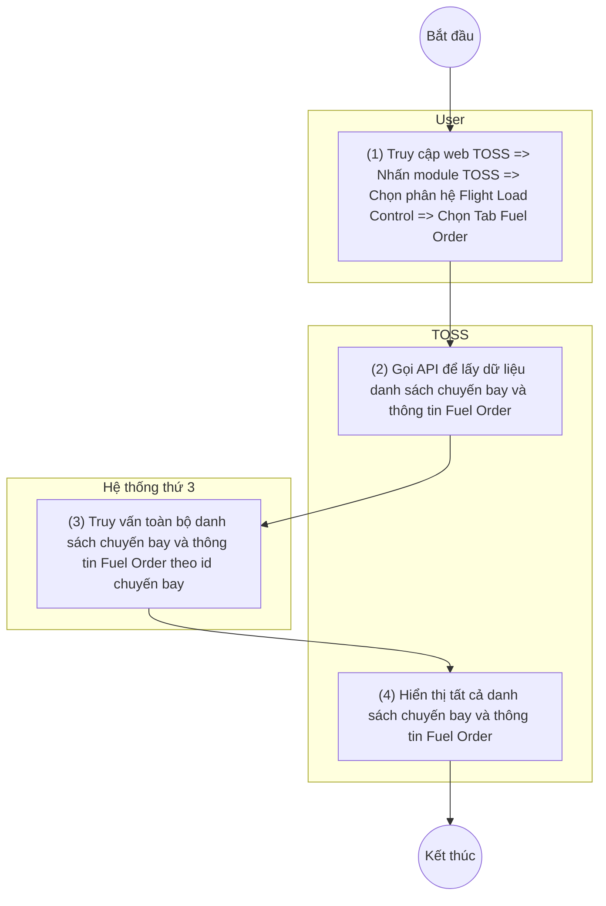

> **Phạm vi file:** Feature F06 (nhóm Fuel order) — trích trung thực 100% từ nguồn SRS Flight Load Control do người soạn (CLAUDE.md §0), không suy diễn, không bổ sung. Cờ điểm cần xác nhận: xem CATALOG.md dòng #6 và mục 2.4 — **3 gạch đầu dòng "Quy tắc hiển thị" (±18h / thời gian thực / thứ tự ETD) vẫn bị gạch bỏ (strikethrough) trong nguồn, giữ nguyên trạng** [Cần làm rõ: hiệu lực quy tắc ±18h ở tab Fuel Order].
>
> **Đồng bộ lại 2026-07-10 theo Google Doc version 2192 — quy tắc lấy dữ liệu nhóm PIC release được viết lại trong nguồn:** khối quy tắc ở Bước 3 tách thành "Quy tắc bóc tách OFP" (OFP Rev / OFP PAYLOAD từ PLD / OFP DOW từ DOW) và "Quy tắc đồng bộ dữ liệu PIC release"; giá trị 4 trường nhóm release đổi nguồn lấy: OFP FUEL = OFP BLOCK FUEL, FUEL ORDER = REQUEST FUEL (trước là TOTAL FUEL cột C.FUEL), TAXI = COR.TAXI FUEL (trước là TAXI cột C.FUEL), TRIP = COR.TRIP FUEL (trước là TRIP cột C.FUEL) — đều lấy "từ bản Flight Release mà PIC release mới nhất"/"đồng bộ từ Database của MO". Nhãn nhóm cột thứ 3 trong bảng mô tả đổi thành "(được đông bộ từ MO thuộc bản PIC release mới nhất)" — giữ nguyên lỗi chính tả "đông bộ" của nguồn.
>
> **Ghi chú tách file:** tiêu đề nhóm `# **Fuel order**` dưới đây nằm cuối mảnh nguồn `sec-08` (hệ quả cắt theo h2), được chuyển về đây vì nó mở đầu nhóm Fuel order (F06–F10).

# **Fuel order**

## **Xem danh sách chuyến bay và thông tin fuel order**

| **Tên chức năng: Xem danh sách chuyến bay và thông tin fuel order** | |
| --- | --- |
| **Mục đích** | Cho phép user xem danh sách chuyến bay và thông tin fuel order |
| **Trigger** | Người dùng truy cập vào web TOSS => nhấn module TOSS => Chọn phân hệ Flight load control => Chọn tab Fuel Order |
| **Tiền điều kiện** | Người dùng đăng nhập thành công và được phân quyền phân hệ Flight load control |
| **Hậu điều kiện** | Mở màn hình danh sách chuyến bay và thông tin fuel order đối với từng chuyến bay |

### **Sơ đồ luồng hệ thống**

> Chuyển từ ảnh sơ đồ luồng gốc (UML Activity, 3 làn User/TOSS/Hệ thống thứ 3) trong Google Doc nguồn — ảnh gốc lưu tại [`_images/TOSS.FLC.FUEL_ORDER_LIST.sodo-luong.png`](../_images/TOSS.FLC.FUEL_ORDER_LIST.sodo-luong.png).

### **Mô tả luồng xử lý**

| Bước | Chi tiết |
| --- | --- |
| 1 | * Người dùng truy cập hệ thống TOSS => Click module TOSS, chọn phân hệ Flight Load Control, sau đó chọn tab Fuel Order |
| 2 | * Hệ thống gọi API lấy đữ liệu danh sách toàn bộ chuyến bay và thông tin Fuel Order |
| 3 | * Đồng bộ danh sách chuyến bay từ Netline:   + Trường hợp data trả ra # null -> có bản ghi danh sách chuyến bay, hiển thị bảng danh sách chuyến bay theo [quy tắc hiển thị](#4lfzq7keam4h)   + Trường hợp data trả ra = null -> không có bản ghi danh sách chuyến bay, hiển thị bảng danh sách chuyến bay trống kèm text “ No data”.   + Trường hợp lỗi đồng bộ từ Netline trong quá trình xử lý => Hiển thị toast: “*An error has occurred, please try again”* * **Cơ chế tự động cập nhật dữ liệu**   + Khi nhận được bản OFP mới nhất được đồng bộ từ MO về: Hệ thống sẽ [mapping chuyến bay](#dj19egjxpzxo) và [bóc tách](#jo9zs5p15n8s) tự động fill vào 3 trường     - OFP Rev (Cập nhật số phiên bản OFP mới nhất)     - OFP PAYLOAD     - OFP DOW   + Khi PIC confirm release OFP => Hệ thống sẽ [mapping chuyến bay](#dj19egjxpzxo) và [đồng bộ dữ liệu từ MO](#kmw54tf23c56) tự động fill vào 5 trường     - PIC Release Rev (Cập nhật số phiên bản mới nhất)     - OFP FUEL     - FUEL ORDER     - TAXI     - TRIP * Quy tắc mapping    + TOSS thực hiện phân loại tài liệu và gắn (mapping) tự động vào đúng chuyến bay tương ứng dựa trên quy tắc đọc thông tin tài liệu   + Cấu trúc tên file: [LOẠI_TÀI_LIỆU]_[FLT_NO]_[DEP]_[EDD]_[dd_mm_yyyy] [hh_mm_ss]     - [LOẠI TÀI LIỆU]: → FLIGHT RELEASE, OFP     - [FLT NO]: → VN343, VN177     - [DEP]: → NGO, HAN     - [EDD]: → 6JUN     - [dd_mm_yyyy] [hh_mm_ss]: → 07_07_2026 22_06_00   => Hệ thống sẽ tự động map [FLT NO ] [EDD] trong tên file vào chuyến bay tương ứng để bóc tách dữ liệu   * Quy tắc bóc tách OFP   + OFP Rev: Hiển thị thông tin phiên bản OFP mới nhất được đồng bộ từ MO về   + OFP PAYLOAD: Bóc tách từ trường PLD trong OFP phiên bản mới nhất   *(hình ảnh minh họa — xem file gốc/Google Doc)*   * + OFP DOW : Được bóc tách từ trường DOW trong OFP phiên bản mới nhất   *(hình ảnh minh họa — xem file gốc/Google Doc)*   * Quy tắc đồng bộ dữ liệu PIC release   + PIC release rev :Hiển thị thông tin phiên bản PIC release mới nhất từ MO về   + OFP FUEL : lấy giá trị OFP BLOCK FUEL từ bản Flight Release mà PIC release mới nhất   + FUEL ORDER: lấy giá trị REQUEST FUEL từ bản Flight Release mà PIC release mới nhất   + TAXI (release): lấy giá trị COR.TAXI FUEL từ bản Flight Release mà PIC release mới nhất   + TRIP (release) : lấy giá trị COR.TRIP FUEL từ bản Flight Release mà PIC release mới nhất |
| 4 | * Hiển thị danh sách chuyến bay và thông tin fuel order của chuyến bay tương ứng |

### **Màn hình chức năng**

### **Mô tả chi tiết màn hình**

| **STT** | **Tên** | **Kiểu dữ liệu [Độ dài]** | **Mapping DB/API** | **Mô tả nghiệp vụ** |
| --- | --- | --- | --- | --- |
| * **Quy tắc hiển thị:**   + ~~Hiển thị danh sách chuyến bay trong khoảng ±18 giờ so với thời điểm hiện tại (UTC).~~   + ~~Danh sách được cập nhật theo thời gian thực.~~   + ~~Thứ tự hiển thị theo chiều top → bottom: Chuyến bay chuẩn bị khai thác → Chuyến bay đang khai thác → Chuyến bay đã khai thác. Sắp xếp theo ETD giảm dần từ trên xuống~~ * Các cột thông tin trên màn danh sách   + Các cột thông tin đồng bộ từ Netline ops ++:     - EDD     - FLT NO     - ACREG     - ACTYPE     - ETD     - DEP     - ARR   + Các cột thông tin hiển thị (dựa trên dữ liệu bóc tách từ bản OFP mới nhất đồng bộ từ MO)     - OFP PAYLOAD     - OFP DOW     - OFP Rev   + Các cột thông tin hiển thị (được đông bộ từ MO thuộc bản PIC release mới nhất)     - PIC release rev     - OFP Fuel     - Fuel Order     - TAXI     - TRIP | | | | |
| 1 | EDD | Datetime |  | * EDD: Ngày dự kiến khởi hành * Hiển thị [EDD ] theo dữ liệu API trả về * Định dạng: ddMMM ( ví dụ: 23JUN) * Trường hợp API trả về rỗng/lỗi: để trống trường |
| 1 | FLT NO | Textview |  | * FLIGHT: Số hiệu chuyến bay * Hiển thị [FLT NO ] theo dữ liệu API trả về * Trường hợp API trả về rỗng/lỗi: để trống trường * Dữ liệu trong cột hiển thị thông tin số hiệu của chuyến bay |
| 2 | ACREG | Textview |  | * ACREG: Số hiệu đăng ký chuyến bay * Hiển thị [ACREG ] theo dữ liệu API trả về * Trường hợp API trả về rỗng/lỗi: để trống trường * Dữ liệu trong cột hiển thị thông tin số hiệu đăng ký của chuyến bay |
| 3 | ACTYPE | Textview |  | * ACTYPE: Loại tàu bay * Hiển thị [ACTYPE ] theo dữ liệu API trả về * Trường hợp API trả về rỗng/lỗi: để trống trường * Dữ liệu trong cột hiển thị thông tin loại tàu bay của chuyến bay |
| 4 | ETD | Textview |  | * ETD: Thời gian cất cánh dự kiến * Hiển thị [ETD] theo dữ liệu API trả về * Trường hợp API trả về rỗng/lỗi: để trống trường * Cấu trúc hiển thị: giờ - phút (hh:mm) * ~~Trường này là cơ sở để hiển thị danh sách chuyến bay theo~~ [~~quy tắc hiển thị~~](#gv48fwux7pm) |
|  | DEP | Textview |  | * DEP: Hiển thị thông tin Điểm đi * Hiển thị [DEP] theo dữ liệu API trả về * Trường hợp API trả về rỗng/lỗi: để trống trường * Dữ liệu trong cột hiển thị thông tin Điểm đi của máy bay * Hiển thị dưới dạng viết tắt của điểm đi |
|  | ARR | Textview |  | * ARR: Hiển thị thông tin Điểm đến * Hiển thị [ARR ] theo dữ liệu API trả về * Trường hợp API trả về rỗng/lỗi: để trống trường * Dữ liệu trong cột hiển thị thông tin Điểm đến * Hiển thị dưới dạng viết tắt của điểm đến |
|  | OFP Rev | Textview |  | * OFP Rev: Hiển thị thông tin phiên bản OFP mới nhất được đồng bộ từ MO về * Hiển thị [OFP Rev ] theo dữ liệu API trả về * Trường hợp API trả về rỗng/lỗi: để trống trường * Dữ liệu trong cột hiển thị thông tin phiên bản OFP mới nhất |
|  | PIC release rev | Textview |  | * PIC release rev: Hiển thị thông tin phiên bản PIC release mới nhất từ MO * Hiển thị [PIC release rev ] theo dữ liệu API trả về * Trường hợp API trả về rỗng/lỗi: để trống trường * Nếu độ dài dữ liệu vượt quá 2 dòng, hiển thị ba chấm […] ở cuối dòng thứ 2 và có tooltip hiển thị toàn bộ nội dung |
|  | EST PAYLOAD | Numer |  | * EST PAYLOAD: Hiển thị Tải trọng dự kiến do KST nhập/ gửi. Đơn vị (**Kg**) * Gía trị lấy từ trường TOTAL PAYLOAD trong màn chi tiết * Hiển thị [EST PAYLOAD] theo dữ liệu API trả về * Trường hợp API trả về rỗng/lỗi: để trống trường * Nếu độ dài dữ liệu vượt quá 2 dòng, hiển thị ba chấm […] ở cuối dòng thứ 2 và có tooltip hiển thị toàn bộ nội dung |
|  | OFP PAYLOAD | Number |  | * OFP PAYLOAD: Hiển thị Tải trọng dự kiến trên OFP. Đơn vị (**Kg**) * Bóc tách từ trường PLD trong OFP phiên bản mới nhất   *(hình ảnh minh họa — xem file gốc/Google Doc)*   * Hiển thị [OFP PAYLOAD] theo dữ liệu API trả về * Trường hợp API trả về rỗng/lỗi: để trống trường * Dữ liệu trong cột hiển thị thông tin Tải trọng dự kiến trên OFP * Nếu độ dài dữ liệu vượt quá 2 dòng, hiển thị ba chấm […] ở cuối dòng thứ 2 và có tooltip hiển thị toàn bộ nội dung |
|  | OFP DOW | Number |  | * OFP DOW: Trọng lượng cơ sở của tàu bay đã sẵn sàng để thực hiện chuyến bay. Đơn vị (**Kg**) * Bóc tách từ trường DOW trong OFP phiên bản mới nhất   *(hình ảnh minh họa — xem file gốc/Google Doc)*   * Hiển thị [OFP DOW] theo dữ liệu API trả về * Trường hợp API trả về rỗng/lỗi: để trống trường * Dữ liệu trong cột hiển thị thông tin Trọng lượng cơ sỏ của tàu bay * Nếu độ dài dữ liệu vượt quá 2 dòng, hiển thị ba chấm […] ở cuối dòng thứ 2 và có tooltip hiển thị toàn bộ nội dung |
|  | DIFFERENCE | Number |  | * Hiển thị Chênh lệch tải trọng. Đơn vị (Kg) * Hệ thống tự động tính toán theo công thức DIFFERENCE = EST PAYLOAD - OFP PAYLOAD để hiển thị ra màn hình * Giá trị có thể số dương **(≥ 0)** hoặc số âm **(< 0)** * Trường hợp API trả về rỗng/lỗi, HOẶC một trong hai trường dữ liệu gốc (EST PAYLOAD, OFP PAYLOAD) bị rỗng: Để trống trường * Nếu độ dài dữ liệu vượt quá 2 dòng, hiển thị ba chấm [...] ở cuối dòng thứ 2 và có tooltip hiển thị toàn bộ nội dung |
|  | OFP FUEL |  |  | * Hiển thị dầu dự kiến trên OFP. Đơn vị (Kg) * Giá trị được đồng bộ từ Database của MO (thuộc bản PIC Release mới nhất), lấy giá trị OFP BLOCK FUEL * Hiển thị [OFP FUEL] theo dữ liệu API trả về * Trường hợp API trả về rỗng/lỗi: để trống trường * Nếu độ dài dữ liệu vượt quá 2 dòng, hiển thị ba chấm […] ở cuối dòng thứ 2 và có tooltip hiển thị toàn bộ nội dung |
|  | FUEL ORDER |  |  | * Hiển thị số dầu mà PIC request. Đơn vị (Kg) * Hiển thị [FUEL ORDER ] theo dữ liệu API trả về * Giá trị được đồng bộ từ Database của MO (thuộc bản PIC Release mới nhất) lấy giá trị REQUEST FUEL * Trường hợp API trả về rỗng/lỗi: để trống trường * Nếu độ dài dữ liệu vượt quá 2 dòng, hiển thị ba chấm […] ở cuối dòng thứ 2 và có tooltip hiển thị toàn bộ nội dung |
|  | TAXI (release) |  |  | * Hiển thị Taxi Fuel. Đơn vị (Kg) * Hiển thị [TAXI] theo dữ liệu API trả về * Giá trị được đồng bộ từ Database của MO (thuộc bản PIC Release mới nhất) lấy giá trị COR.TAXI FUEL * Trường hợp API trả về rỗng/lỗi: để trống trường * Dữ liệu trong cột hiển thị thông tin Taxi Fuel * Nếu độ dài dữ liệu vượt quá 2 dòng, hiển thị ba chấm […] ở cuối dòng thứ 2 và có tooltip hiển thị toàn bộ nội dung |
|  | TRIP (release) |  |  | * Hiển thị Trip Fuel. Đơn vị (Kg) * Hiển thị [TRIP] theo dữ liệu API trả về * Giá trị được đồng bộ từ Database của MO (thuộc bản PIC Release mới nhất) lấy giá trị COR.TRIP FUEL * Trường hợp API trả về rỗng/lỗi: để trống trường * Nếu độ dài dữ liệu vượt quá 2 dòng, hiển thị ba chấm […] ở cuối dòng thứ 2 và có tooltip hiển thị toàn bộ nội dung |

---

**Nguồn trích:** `sec-09-xem-danh-sach-chuyen-bay-va-thong-tin-fu.md` + tiêu đề nhóm `# **Fuel order**` từ cuối `sec-08-customize-bang-bieu.md` (các mảnh phân rã h2 từ `VNA.TOSS_SRS_Flight Load Control_v0.1.md`, đã xóa sau khi tách theo Feature — git giữ lịch sử) · CATALOG.md dòng #6. **Đồng bộ lại 2026-07-10 theo Google Doc version 2192** (sửa 2026-07-10T10:57:39Z bởi chuyenly2003; bản phân rã trước theo version 2074).
